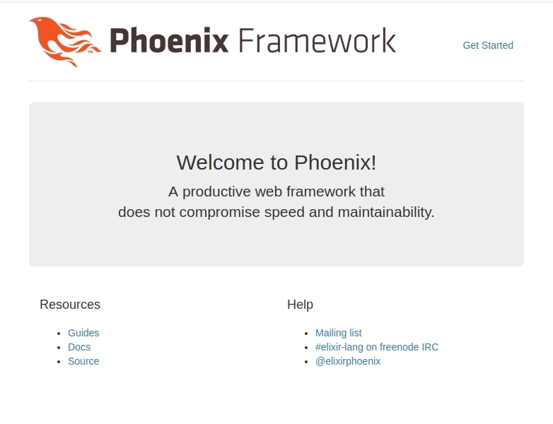
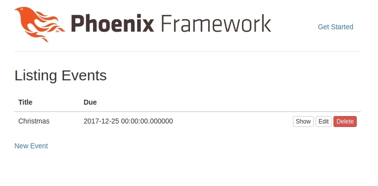
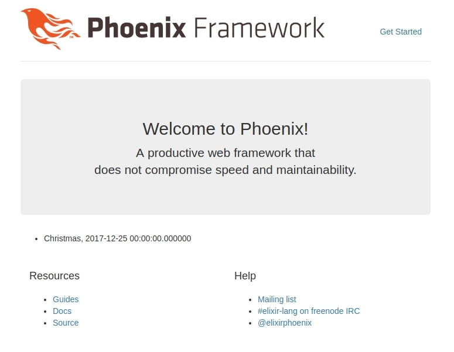
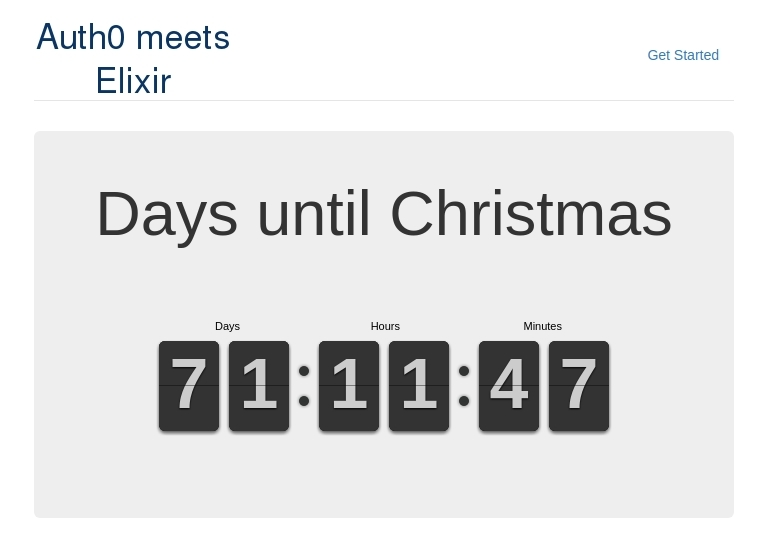
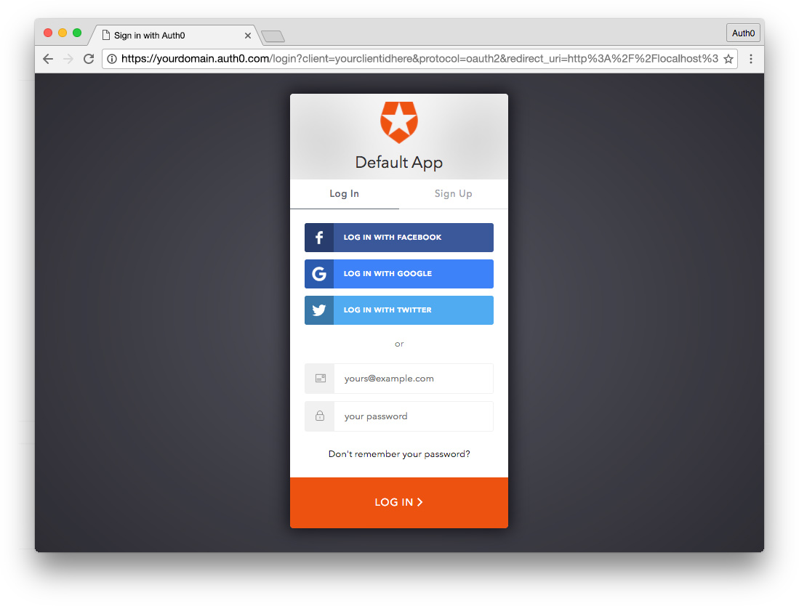
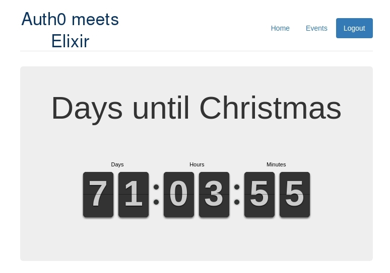

**TL;DR:** The [Elixir language](https://elixir-lang.org) is dynamically typed with lots of helpful documentation. It builds on [Erlang](http://www.erlang.org) and the Erlang VM. You can be up and running almost immediately. If your app compiles, it's already deployable. The [Phoenix framework for Elixir apps](http://phoenixframework.org) is genuinely exciting to use. Let's build an easy-to-use application that manages upcoming events, built with the Phoenix Framework and authenticated with [Auth0](https://auth0.com). The final code can be found at the [auth0-elixir-countdown GitHub repo](https://github.com/lukeoliff/auth0-elixir-countdown).

**This post is original content developed by me for the [Auth0's blog](https://auth0.com/blog) and has been re-posted here as part of an online portfolio with permission. Relevant attribution and canonical links exist. [Click here to see the original](https://auth0.com/blog/oauth2-the-complete-guide/).**

---

## Elixir language

Personally, I've been stuck under a rock as a developer. I've missed plenty of cool languages whilst playing with PHP—and the [Elixir language](https://elixir-lang.org) is no exception. Fortunately for me, Elixir (like PHP) is a dynamically typed language with lots of helpful documentation. My brain didn't have to work ***too*** hard to build something practical and fun. Elixir builds on [Erlang](http://www.erlang.org) and leverages the Erlang VM. Its got a super small footprint and is surprisingly robust. You can be up and running almost immediately.

***It doesn't stop there.***

If your Elixir app compiles, it's practically deployable already and the how-to guides come ready to talk you through getting it online with [Heroku](https://www.heroku.com).

> **Note:** This article was written assuming you have a good understanding of functional programming languages. Elixir is a functional, concurrent, general-purpose programming language. It runs on the Erlang virtual machine (BEAM). Elixir builds on top of Erlang and shares the same abstractions for building distributed, fault-tolerant applications. Check out Elixir School for [lessons about the Elixir programming language](https://elixirschool.com/en/).

## Phoenix framework

You can't escape the [Phoenix framework](http://phoenixframework.org) if you're looking for a good tool to build on in Elixir. They portray themselves as a fresh approach to tried and tested MVC development. Phoenix genuinely excites me. One aspect is just how well we can separate our concerns across an extremely well thought out, logical structure. Another is that it provides a fantastic command line interface.

Phoenix is an MVC framework written in Elixir and will be welcoming and comfortable to use for anyone familiar with [Rails](http://rubyonrails.org/) or [Django](https://www.djangoproject.com/).

> The Phoenix framework provides the best of both worlds: high developer productivity and high application performance. It also has some interesting new twists like channels for implementing realtime features and pre-compiled templates for blazing speed.

## What should we build?

With holiday season fast approaching and a growing family, we're counting down the days when we can sit at home, in front of our (fake) fireplace and open some presents! :)

So, I thought, why not build an application where I can see countdowns to my favorite events?

- https://days.to/until/easter
- http://www.xmasclock.com

## Getting ready

### Install Elixir

Follow the Elixir language install guide here: http://elixir-lang.org/install.html

Next, we run a `mix` command to install the Hex package manager. Mix is a build tool that provides tasks for creating, compiling, and testing Elixir projects, managing its dependencies, and more. If you know Ruby well, Mix is Rake, Bundler, and RubyGems combined.

Now use mix to install hex: https://hexdocs.pm/mix/1.0.5/Mix.Tasks.Local.Hex.html

```bash
$ mix local.hex
```

### Install Phoenix

Phoenix needs at least Elixir 1.4 and Erlang 18 or later, run:

```bash
$ elixir -v
Erlang/OTP 19 [erts-8.3] [source] [64-bit] [smp:8:8] [async-threads:10] [hipe] [kernel-poll:false] [dtrace]

Elixir 1.4.2
```

Now we can install Phoenix v1.3.0:

```bash
$ mix archive.install https://github.com/phoenixframework/archives/raw/master/phx_new-1.3.0.ez
```

### Other requirements

To follow this guide fully, make sure you also have PostgreSQL and npm installed.

- http://postgresguide.com/setup/install.html
- https://docs.npmjs.com/getting-started/installing-node

If you choose to use another database provider, make sure you edit the configuration appropriately.

- https://phoenixframework.readme.io/docs/using-mysql

## Our Phoenix application skeleton

Now we can create a new application with the Phoenix framework. Let's call our application "countdown".

```bash
$ mix phx.new countdown
```

It will now generate a skeleton application with config, controllers, routing, etc... Everything you need, really!

```bash
* creating countdown/config/config.exs
* creating countdown/config/dev.exs
* creating countdown/config/prod.exs
...
* creating countdown/assets/static/favicon.ico
```

When prompted, fetch and install dependencies.

> Phoenix uses [Brunch.io](http://brunch.io) for asset management. Brunch.io’s dependencies are installed via the node package manager, not mix. Phoenix will prompt us to install them at the end of the mix phx.new task. If we say “no” at that point, and if we don’t install those dependencies later with npm install, our application will raise errors when we try to start it, and our assets may not load properly. If we don’t want to use Brunch.io at all, we can simply pass --no-brunch to mix phx.new.

```bash
Fetch and install dependencies? [Yn] Y
```

It will fetch and compile our dependencies.

```bash
* running mix deps.get
* running mix deps.compile
* running cd assets && npm install && node node_modules/brunch/bin/brunch build
```

Once it's finished it will give you some helpful info to check that it's all working, running your application, and even how to interact with your app inside IEx (Interactive Elixir).

Check out the following to learn more about [debugging techniques in Elixir using IEx](http://blog.plataformatec.com.br/2016/04/debugging-techniques-in-elixir-lang/).

So let's change directory and check we can run the application.

```bash
$ cd countdown && mix phx.server
```

It shows us the compilation including any warnings or errors including deprecations or unused variables. Very cool.

```bash
[info] Running CountdownWeb.Endpoint with Cowboy using http://localhost:4000
Compiling 13 files (.ex)
..
==> mime
Compiling 1 file (.ex)
warning: String.strip/1 is deprecated, use String.trim/1
  lib/mime.ex:28
...
[info] Sent 200 in 18ms
```

Now we can take a look our app by visiting http://localhost:4000. It should look something like...



## Countdown Application

### CRUD pattern

We need to be able to store the events we are going to count down to.

Before we can start adding our data, we need to set up the database. Open up `config/dev.exs`, and edit the username and password near the bottom of the file. (They will both be set to “postgres” by default.)

```elixir
...
config :countdown, Countdown.Repo,
  adapter: Ecto.Adapters.Postgres,
  username: "auth0",
  password: "phoenixelixir",
  database: "countdown",
...
```

If you didn't run it yet, let's create the database now.

```bash
$ mix ecto.create
The database for Countdown.Repo has been created
```

Now comes the backbone of our application, the CRUD actions for the events. In order to achieve this, Phoenix supports us with four different generators:

> `mix phoenix.gen.html`
> Gen HTML creates: model, view, controllers, repository, templates, tests

> `mix phoenix.gen.channel`
> Gen Channel creates: channel and tests

> `mix phoenix.gen.json`
> Gen JSON, for APIs really, creates: model, view, controllers, repository, tests

> `mix phoenix.gen.model`
> Gen Model creates: model and repository

We use the first generator which creates all resources and actions for us, the same as rails generators. We need to declare the name as a collection, singular and plural, and next the field names with types.

```bash
$ mix phx.gen.html Events Event events title due:datetime
```

We're pretty close to having a CRUD application ready to go!

```bash
* creating lib/countdown_web/controllers/event_controller.ex
* creating lib/countdown_web/templates/event/edit.html.eex
...
* injecting test/countdown/events/events_test.exs
```

Go and edit `lib/countdown_web/router.ex` and place `resources "/events", EventController` inside the `CountdownWeb` scope.

```diff
   ...
   scope "/", CountdownWeb do
     pipe_through :browser # Use the default browser stack

     get "/", PageController, :index
+    resources "/events", EventController
   end
   ...
```

Now we can migrate our new model into the database.

```bash
$ mix ecto.migrate
Compiling 10 files (.ex)
Generated countdown app
[info] == Running Countdown.Repo.Migrations.CreateEvents.change/0 forward
[info] create table events
[info] == Migrated in 0.0s
```

Let's run our server to make sure it's still working.

```bash
$ mix phx.server
```

If it is still working, this time we can head to http://localhost:4000/events and see our new CRUD interfaces.



### Showing off our events

We could list all events on our homepage, but as we are going to have countdown clocks, it's important we only list future events. For this, we're going to need a way to fetch events in the future. Let's give it a go...

Edit `lib/countdown/events/events.ex` which is the repository module for our events.

You'll find the query structure familiar, especially if you've used any well-known database abstraction layers, like Doctrine or Django ORM, or even if you are experienced with SQL itself. We're going to be selecting `from` `Countdown.Events.Event` where `due` is greater than or equal to the current UTC timestamp.

```elixir
query = from e in Countdown.Events.Event,
        where: e.due >= ^DateTime.utc_now
```

> The docblock shows you how to run the method in IEx (interactive Elixir) and the format of the response, usually an example `[%Map{}, ...]`.

```diff
   ...

   def list_events do
     Repo.all(Event)
   end
+
+   @doc """
+   Returns the list of future events.
+
+   ## Examples
+
+       iex> list_future_events()
+       [%Event{}, ...]
+
+   """
+   def list_future_events do
+     query = from e in Countdown.Events.Event,
+       where: e.due >= ^DateTime.utc_now
+     Repo.all(query)
+   end

   ...
```

Next, we add this to the controller and display some items on the homepage. Let's edit our homepage controller at `lib/countdown_web/controllers/page_controller.ex`

```diff
   ...
   use CountdownWeb, :controller
+  alias Countdown.Events
 
   def index(conn, _params) do
+    events = Events.list_future_events()
-    render conn, "index.html"
+    render conn, "index.html", events: events
   end
   ...
```

Nowe we'll edit our homepage template at `lib/countdown_web/templates/page/index.html.eex` and add a very simple list of items, we'll come back and make turn this into our countdown clocks later.

```diff
   <div class="jumbotron">
     <h2><%= gettext "Welcome to %{name}!", name: "Phoenix" %></h2>
     <p class="lead">A productive web framework that<br />does not compromise speed and maintainability.</p>
   </div>

+  <ul>
+  <%= for event <- @events do %>
+    <li><%= event.title %>, <%= event.due %></li>
+  <% end %>
+  </ul>
   ...
```

> **Note:** I've added last Christmas so we can see our query works, only showing future events.


Now we can see our list is limited to only events in the future. Perfect!



### Adding our countdown clocks

We're going to use [FlipClock.js](http://flipclockjs.com) to create our countdown clocks. Edit the base app template `lib/countdown_web/templates/layout/app.html.eex`

```diff
    ...
    <link rel="stylesheet" href="<%= static_path(@conn, "/css/app.css") %>">
+   <link rel="stylesheet" href="https://cdnjs.cloudflare.com/ajax/libs/flipclock/0.7.8/flipclock.min.css" />
+   <script src="https://code.jquery.com/jquery-3.2.1.slim.min.js"></script>
+   <script src="https://cdnjs.cloudflare.com/ajax/libs/flipclock/0.7.8/flipclock.min.js"></script>
    ...
```

Now edit the homepage template `lib/countdown_web/templates/page/index.html.eex` and replace it with the contents below. It uses a very basic jQuery loop to apply FlipClock to each `.countdownClock` element. The Bootstrap jumbotron is perfect for the quick and easy layout we want here because of its clear heading and very basic markup.

```html
<%= for event <- @events do %>
    <div class="jumbotron">
      <span class="h1">Days until <%= event.title %></span>
      <p class="text-center"><span class="countdownClock" data-due="<%= event.due %>"></span></p>
    </div>
<% end %>
<script>
$(document).ready(function() {
    $('.countdownClock').each(function(i, el) {
      var today = new Date();
      var due = new Date($(el).data('due'));

      $(el).FlipClock((due/1000) - (today/1000), {
          clockFace: 'DailyCounter',
            countdown: true,
            showSeconds: false
      });
    });
});
</script>
```

Our last little styling tweaks are just to center the countdown clocks and replace the logo with something more appropriate :)

Edit `assets/css/app.css` and add the following. You're going to need your own logo!

```css
/* This file is for your main application css. */

.auth0-logo {
  width: 200px;
  height: 80px;
  display: inline-block;
  background-image: url(http://placehold.jp/ffffff/003366/200x80.png?text=Auth0%20meets%0AElixir);
  background-repeat: no-repeat;
  background-size: 200px;
}

.jumbotron .flip-clock-wrapper {
  text-align: center;
  position: relative;
  width: auto;
  margin-top: 8em;
  display: inline-block;
}
```

Now edit `lib/countdown_web/templates/layout/app.html.eex` to use the new logo styling.

```diff
-       <span class="logo"></span>
+       <span class="auth0-logo"></span>
```

We should see something like this, our own app in which we can control what events we display!



## Authentication with Auth0

Last of all, we'll secure administration of events with Auth0's [Centralized Login Page](https://auth0.com/docs/hosted-pages/login). Providing us with Auth0's [JSON Web Token](http://jwt.io), we will be able to securely verify users inside the application.



### Sign Up for Auth0

You'll need an [Auth0](https://auth0.com) account to manage authentication. You can sign up for a <a href="https://auth0.com/signup">free account here</a>. Next, set up an Auth0 Client and API so Auth0 can interface with your app and API.

### Set Up a Client App

1. Go to your [**Auth0 Dashboard**](https://manage.auth0.com/#/) and click the "[create a new client](https://manage.auth0.com/#/clients/create)" button. 
2. Name your new app and select "Regular Web Applications". 
3. In the **Settings** for your new Auth0 client app, add `http://0.0.0.0:4000/auth/auth0/callback` to the **Allowed Callback URLs**.
4. Click the "Save Changes" button.
5. If you'd like, you can [set up some social connections](https://manage.auth0.com/#/connections/social). You can then enable them for your app in the **Client** options under the **Connections** tab. The example shown in the screenshot above utilizes username/password database, Facebook, Google, and Twitter.

> Note: On the **OAuth** tab of **Advanced Settings** (at the bottom of the **Settings** section) you can see the **JsonWebToken Signature Algorithm** is set to `RS256`. This is now the default, [read more about RS256 vs HS256 here](https://community.auth0.com/questions/6942/jwt-signing-algorithms-rs256-vs-hs256).

### Install the Ueberauth module

Edit `mix.exs` and add the `Ueberauth` module to your dependencies and application compilation order.

```diff
   ...

   def application do
     [
       mod: {Countdown.Application, []},
-      extra_applications: [:logger, :runtime_tools]
+      extra_applications: [:ueberauth, :ueberauth_auth0, :logger, :runtime_tools]
     ]
   end

   ...

   defp deps do
     [
       ...
-      {:cowboy, "~> 1.0"}
+      {:cowboy, "~> 1.0"},
+      {:ueberauth, "~> 0.4"},
+      {:ueberauth_auth0, "~> 0.3"}
     ]
   end

   ...
```

You can also use a GitHub repository as your package source to use the latest changes. Beware—it might have breaking and unstable code. For example:

```diff
   ...

   defp deps do
     [
       ...
-      {:cowboy, "~> 1.0"}
+      {:cowboy, "~> 1.0"},
+      {:ueberauth_auth0, github: "sntran/ueberauth_auth0"}
     ]
   end

   ...
```

Now that it's configured we need to install our dependencies.

```bash
$ mix deps.get
```

Edit `config/config.exs` to configure `Ueberauth`.

```diff
...
import_config "#{Mix.env}.exs"

+
+# Configures Ueberauth
+config :ueberauth, Ueberauth,
+  providers: [
+    auth0: { Ueberauth.Strategy.Auth0, [] },
+  ]
+
+# Configures Ueberauth's Auth0 auth provider
+config :ueberauth, Ueberauth.Strategy.Auth0.OAuth,
+  domain: System.get_env("AUTH0_DOMAIN"),
+  client_id: System.get_env("AUTH0_CLIENT_ID"),
+  client_secret: System.get_env("AUTH0_CLIENT_SECRET")
```

Configured like this, we can now control our config through environment variables. For more information on how to define these check out [this guide on bash environment variables](http://www.tricksofthetrades.net/2015/06/14/notes-bash-env-variables/).

Later, we'll be looking at starting our application with environment variables included. You can choose to set them up however you wish, but they're required at compile time to make our authentication work.

An example of how to launch the application with environment variables:

```bash
$ AUTH0_DOMAIN=<Your domain> \
  AUTH0_CLIENT_ID=<Your client ID> \
  AUTH0_CLIENT_SECRET=<Your client secret> \
  mix phx.server
```

### Setup authentication

First, we'll create a new model for reading user info. Open a new file at `lib/countdown_web/models/user_from_auth.ex`. This model, courtesy of <a href="https://twitter.com/IT_Supertramp">Thomas Peitz</a>, will give us easy access to details obtained back from authentication payload. It also supports multiple formats of profile information. For example, providers like GitHub and Facebook give a profile image url, slightly different.
             
```elixir
defmodule UserFromAuth do
  @moduledoc """
  Retrieve the user information from an auth request
  """
  require Logger
  require Poison

  alias Ueberauth.Auth

  def find_or_create(%Auth{provider: :identity} = auth) do
    case validate_pass(auth.credentials) do
      :ok ->
        {:ok, basic_info(auth)}
      {:error, reason} -> {:error, reason}
    end
  end

  def find_or_create(%Auth{} = auth) do
    {:ok, basic_info(auth)}
  end

  # github does it this way
  defp avatar_from_auth( %{info: %{urls: %{avatar_url: image}} }), do: image

  # facebook does it this way
  defp avatar_from_auth( %{info: %{image: image} }), do: image

  # default case if nothing matches
  defp avatar_from_auth( auth ) do
    Logger.warn auth.provider <> " needs to find an avatar URL!"
    Logger.debug(Poison.encode!(auth))
    nil
  end

  defp basic_info(auth) do
    %{id: auth.uid, name: name_from_auth(auth), avatar: avatar_from_auth(auth)}
  end

  defp name_from_auth(auth) do
    if auth.info.name do
      auth.info.name
    else
      name = [auth.info.first_name, auth.info.last_name]
      |> Enum.filter(&(&1 != nil and &1 != ""))

      cond do
        length(name) == 0 -> auth.info.nickname
        true -> Enum.join(name, " ")
      end
    end
  end

  defp validate_pass(%{other: %{password: ""}}) do
    {:error, "Password required"}
  end
  defp validate_pass(%{other: %{password: pw, password_confirmation: pw}}) do
    :ok
  end
  defp validate_pass(%{other: %{password: _}}) do
    {:error, "Passwords do not match"}
  end
  defp validate_pass(_), do: {:error, "Password Required"}
end
```

Next, create a new controller. Call it `AuthController` and create it at `lib/countdown_web/controllers/auth_controller.ex`. This controller has a few responsibilities:

 - **Callback** Handles the success or failure of our auth request. On success, stores the user in a session.
 - **Logout** Drops the session.
 - **Helpers** Providers a basepath for our `Ueberauth` strategy helpers, meaning `/auth/auth0` will now allow us to authenticate with the Auth0 provider we setup.

```elixir
defmodule CountdownWeb.AuthController do
  use CountdownWeb, :controller
  alias CountdownWeb.Router.Helpers

  plug Ueberauth

  alias Ueberauth.Strategy.Helpers

  def logout(conn, _params) do
    conn
    |> put_flash(:info, "You have been logged out!")
    |> configure_session(drop: true)
    |> redirect(to: "/")
  end

  def callback(%{assigns: %{ueberauth_failure: _fails}} = conn, _params) do
    conn
    |> put_flash(:error, "Failed to authenticate.")
    |> redirect(to: "/")
  end

  def callback(%{assigns: %{ueberauth_auth: auth}} = conn, _params) do
    case UserFromAuth.find_or_create(auth) do
      {:ok, user} ->
        conn
        |> put_flash(:info, "Successfully authenticated as " <> user.name <> ".")
        |> put_session(:current_user, user)
        |> redirect(to: "/")
      {:error, reason} ->
        conn
        |> put_flash(:error, reason)
        |> redirect(to: "/")
    end
  end
end
```

Now we need to add endpoints for the controller to the router. Edit `lib/countdown_web/router.ex` to configure these routes.

```diff
 defmodule CountdownWeb.Router do
   use CountdownWeb, :router
+  require Ueberauth

...

+  scope "/auth", CountdownWeb do
+    pipe_through :browser
+
+    get "/:provider", AuthController, :request
+    get "/:provider/callback", AuthController, :callback
+    post "/:provider/callback", AuthController, :callback
+  end
+

...

   scope "/", CountdownWeb do
      pipe_through :browser # Use the default browser stack
      get "/", PageController, :index
+     get "/logout", AuthController, :logout

...

```

### Secure our application

To secure our events controller, edit `lib/countdown_web/controllers/event_controller.ex` and add a `Plug` which will be called by the controller prior to every endpoint. This will now check our current session for a verified user.

```diff
   ...
   alias Countdown.Events.Event
+
+  plug :secure
+
+  defp secure(conn, _params) do
+    user = get_session(conn, :current_user)
+    case user do
+     nil ->
+         conn |> redirect(to: "/auth/auth0") |> halt
+     _ ->
+       conn
+       |> assign(:current_user, user)
+    end
+  end

   def index(conn, _params) do
   ...
```

Now our `/events` endpoints are secured, we just need a helpful menu to navigate the site.

**Nearly there!**

Lets edit our `PageController` found at `lib/countdown_web/controllers/page_controller.ex` to add our `current_user` property, allowing us to access it elsewhere.

```diff
   def index(conn, _params) do
     events = Events.list_future_events()
-    render conn, "index.html", events: events
+    render conn, "index.html", events: events, current_user: get_session(conn, :current_user)
   end
```

The base app template needs to be edited `lib/countdown_web/templates/layout/app.html.eex`, it is going to check for our current user. If we don't have one, we'll show a link to login.

```diff
...
   <ul class="nav nav-pills pull-right">
-    <li><a href="http://www.phoenixframework.org/docs">Get Started</a></li>
+    <%= if @current_user do %>
+    <li><a href="/">Home</a></li>
+    <li><a href="/events">Events</a></li>
+    <li class="active"><a href="/logout">Logout</a></li>
+    <% else %>
+    <li><a href="/">Home</a></li>
+    <li><a href="/auth/auth0">Login</a></li>
+    <% end %>
   </ul>
...
```

Start our application, remembering our environment variables. 

```bash
$ AUTH0_DOMAIN=<Your domain> \
  AUTH0_CLIENT_ID=<Your client ID> \
  AUTH0_CLIENT_SECRET=<Your client secret> \
  mix phx.server
```

**Log in, have a play and it should look something like this!**



## Credits

A big thanks to <a href="https://twitter.com/IT_Supertramp">Thomas Peitz</a> for his help and suggestions.

## Conclusion

We've learned how to build a basic CRUD application in Elixir. It utilizes the Phoenix framework, allowing us to create applications in a straightforward way using the simple command line interface. We've also learned how to write some basic security using [Auth0](https://auth0.com) inside Elixir.

To learn more about the Phoenix Framework, check out [phoenixframework.org](http://phoenixframework.org).

To learn more about Elixir, check out [elixir-lang.org](https://elixir-lang.org).

I went into this project with no prior knowledge of Elixir or Phoenix. The result is, I believe I can probably deliver a robust application that is production ready and deployable faster using Phoenix than I could in some other languages. It has been an amazing and eye-opening experience and I'm looking forward to getting the opportunity to pick up more languages and doing something cool with them.

**The final code can be found at the [auth0-elixir-countdown GitHub repo](https://github.com/lukeoliff/auth0-elixir-countdown).**
