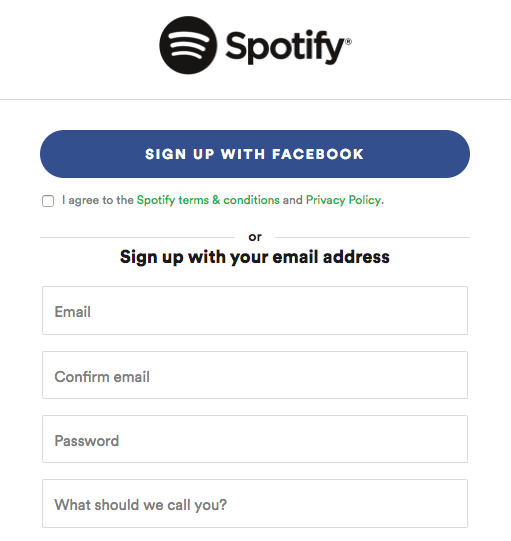
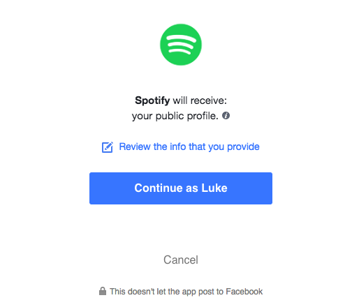
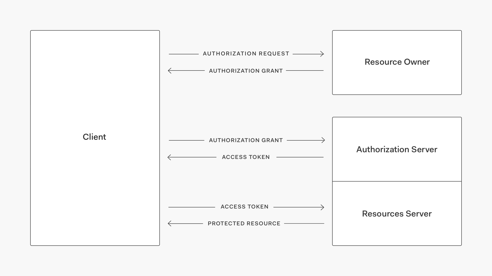
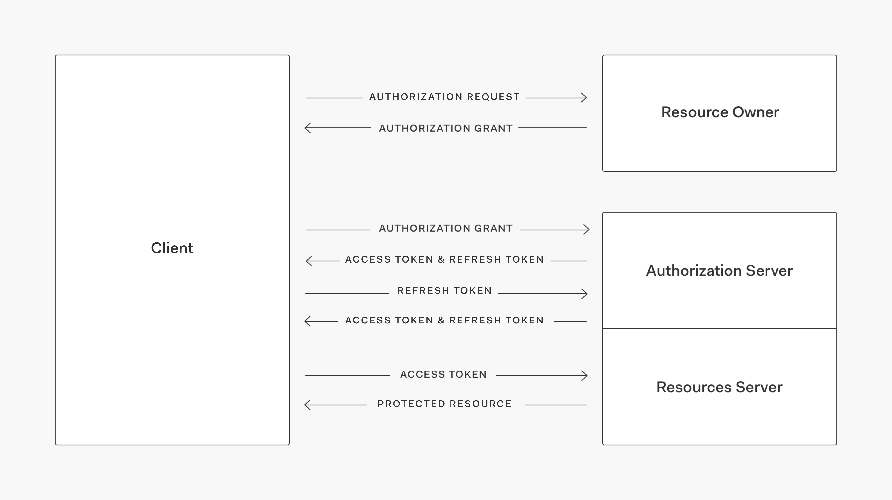

Have you visited a site recently, where you are given the option of connecting or signing up using Google, Facebook or Twitter? Sure you have! This is basically what OAuth is all about; granting third-party services permission to do something for you–like logging you in. In this article, you will learn what OAuth is, how it started, and how it works. 

**This post is original content developed by me for the [Auth0's blog](https://auth0.com/blog) and has been re-posted here as part of an online portfolio with permission. Relevant attribution and canonical links exist. [Click here to see the original](https://auth0.com/blog/oauth2-the-complete-guide/).**

> **Note:** For the purposes of this article and the comfort of the target audience, OAuth is to be assumed as OAuth 2.0 unless specifically mentioning another version.

## So what is OAuth?

OAuth (or Open Authorization) is a framework that gives users the ability to grant access to their information stored in one place, from another place. For example, granting Spotify access to your Facebook profile.

The idea is that you're giving Spotify certain permission to access your Facebook details, so that Facebook can provide Spotify with enough information to sign you up, enhance your profile details, or display what your friends are listening to. Meanwhile, more sensitive information, such as your conversations, remain entirely closed off to Spotify. They only get access to the bits they're *authorized* to see.

> _"Many luxury cars today come with a valet key. It is a special key you give the parking attendant and unlike your regular key, will not allow the car to drive more than a mile or two. You give someone limited access to your car with a special key, while using your regular key to unlock everything."_ — OAuth.net

## How did OAuth start?

Before initiatives like OAuth appeared, you would have had to give Spotify access to your Facebook login details for Spotify to be able to access your information on Facebook.

OAuth was first developed in 2007 by a group seeking to standardize how we can delegate permissions between different software applications. The latest version, OAuth 2.0, is not backwards compatible with previous versions which have now been deprecated. Despite deprecating old versions, they remain in use widely across the web, including by one of the original drivers behind the general OAuth movement, Twitter. Some feel that it is less secure and it has been described as a [road to hell](http://hueniverse.com/2012/07/26/oauth-2-0-and-the-road-to-hell/).

## How does OAuth work?

To understand how OAuth works, we need to understand Roles, grant types, access tokens, and refresh tokens.

### Roles

First we need to understand how it separates the responsibility of our requests. Roles are used to define the separate entities involved in a request.

#### The Client

The client is the application trying to access the user's account. It needs Authorization to do so. This might be the website you're on, the app you've installed to your phone, or both. In our example, this would be Spotify.

#### The Resource Server

The resource server is the place storing the user's information. In our example, this would be Facebook.

#### The Authorization Server

This is the server that asks the user to approve or deny the request. This would also be Facebook, but a separate service that Facebook operate with the purpose of handling authorization.

#### The Resource Owner

The resource owner is the person who is giving access to their data. So if you're giving Spotify permission to access your Facebook info, you're the resource owner.

### Grant types

A grant represents the user's permission to access their data and can be used to acquire an access token. The OAuth Specification describes four flows for acquiring an access token. These flows are called grant types. Which one is more suitable for you will most likely depend on the type of client.

**[Authorization Code](https://auth0.com/docs/api-auth/grant/authorization-code):** used by Web Apps executing on a server. This is also used by mobile apps, using the [Proof Key for Code Exchange (PKCE) technique](https://auth0.com/docs/api-auth/grant/authorization-code-pkce).

**[Implicit](https://auth0.com/docs/api-auth/grant/implicit):** used by JavaScript-centric apps (Single Page Applications) executing on the user's browser.

**[Resource Owner Password Credentials](https://auth0.com/docs/api-auth/grant/password):** used by trusted apps.

**[Client Credentials](https://auth0.com/docs/api-auth/grant/client-credentials):** used for machine to machine communication, such as API auth.

This article will only touch on the most common form of grant type which is going to help us shed light on OAuth, without overcomplicating it. [Read more about OAuth 2.0 and the other grant types](https://auth0.com/docs/protocols/oauth2).

#### Authorization code grant

An authorization code grant is what we'd encounter in our example.

**The Client** will redirect the user to the **The Authorization Server** with some information about what they're requesting and where they're requesting it from, among other things. 

The user will be asked to login to **The Authorization Server** and approve **The Client**, receiving an authorization code. 

**The Client** can now send that code and our grant type to **The Authorization Server** and receive back an access token. 

### Access tokens

Access tokens represent your authorization to access **The Resource Owner**'s information on **The Resource Server**. You're required to exchange your grant for an access token, which will have an expiry time.

Access tokens expire so that any malicious use and damage is limited. You'll need a new access token once it has expired. They can be setup to expire after any amount of time, usually a few minutes.

### Refresh tokens

Refresh tokens are a special type of token that can be held **securely** by **The Client** with the express purpose of being able to request a new access token from **The Authorization Server** once the original access token has expired. These can also expire, but are generally long lived with expiry times that can be as long as 14 days or more.

**The Authorization Server** should be able to revoke a refresh token in the event that it could have been compromised.

## OAuth at Auth0

Auth0 is a global leader in Identity-as-a-Service (IDaaS) and provides thousands of customers in every market sector with the only identity solution they need for their web, mobile, IoT, and internal applications.

At Auth0 we utilize OAuth 2.0 along with Open ID Connect (OIDC) which is an identity layer built upon OAuth 2.0. OAuth is not the only authorization protocol we use, but it is one of the most popular.

For more information, visit https://auth0.com, <a href="https://auth0.com/signup">sign up for a free Auth0 account here</a> or follow @auth0 on Twitter.
