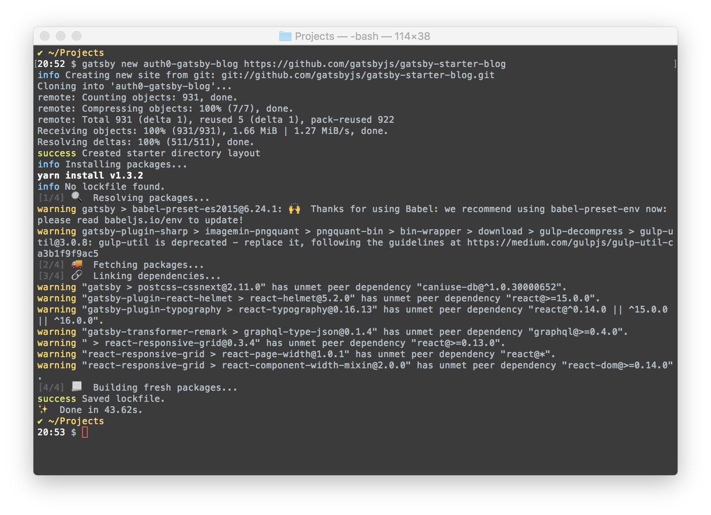
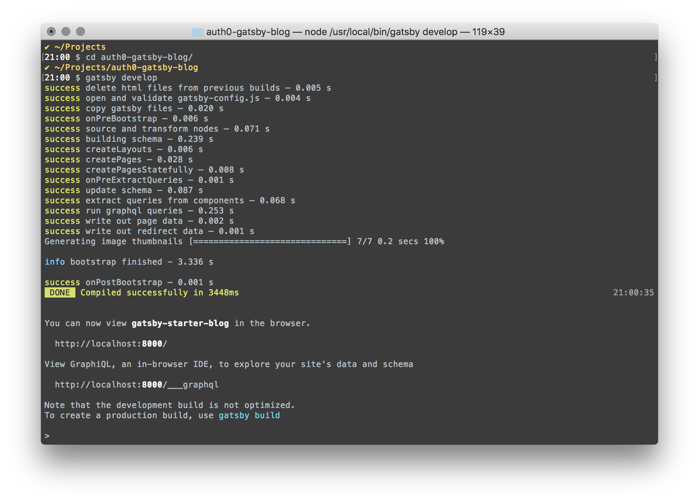
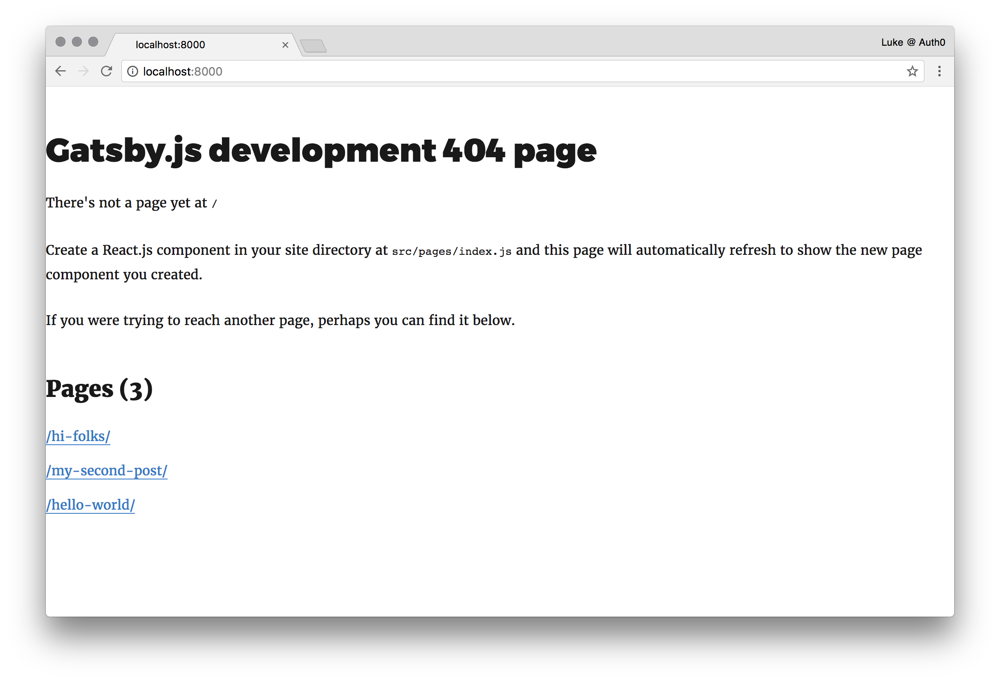
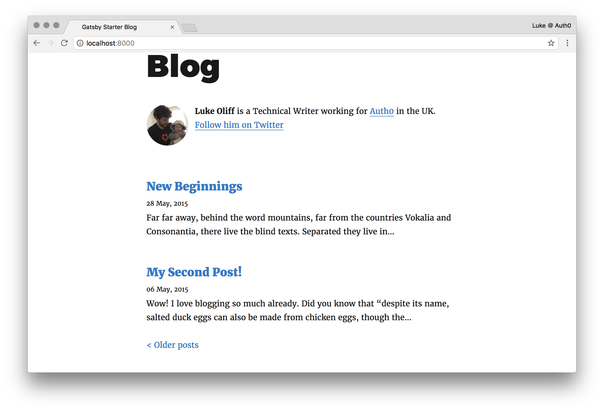
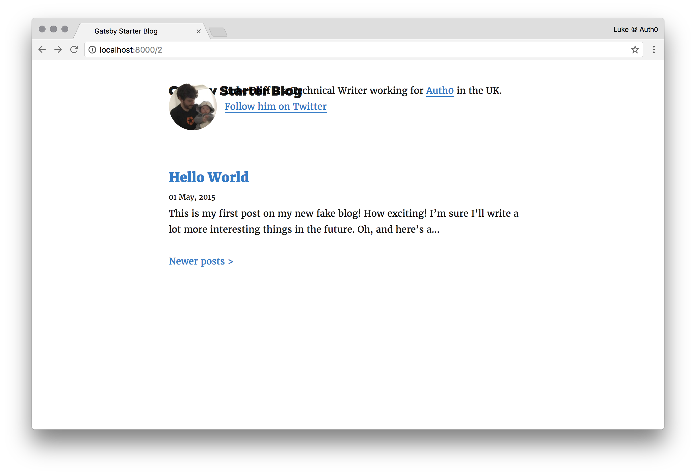
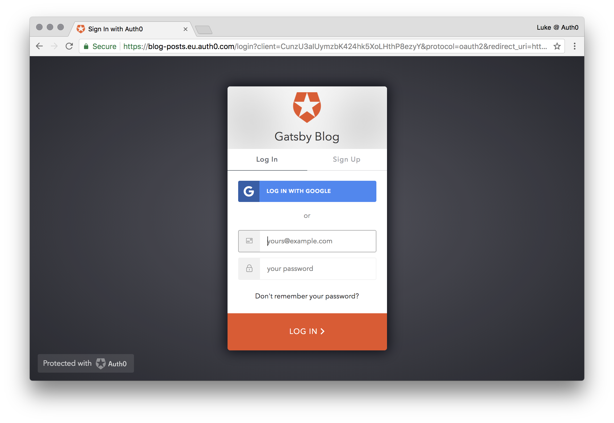
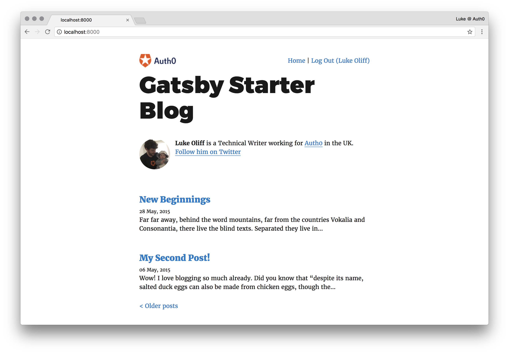
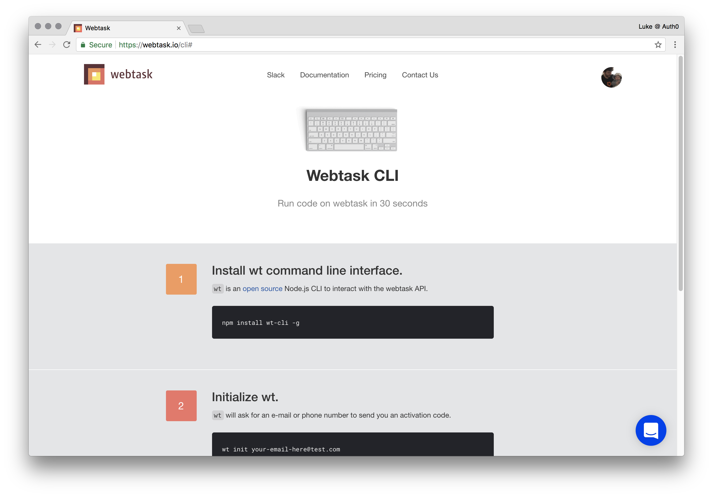
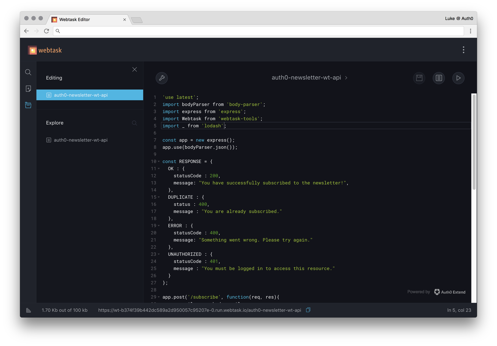

**TL;DR:** [Gatsby](https://www.gatsbyjs.org/) is a modern [React](https://reactjs.org/) based static content generator, and it boasts an [impressive list](https://www.gatsbyjs.org/features/#legend) of out-the-box features. In this article, we're going to be building a blog, and adding extra features like pagination, user authentication with [Auth0.js](https://auth0.com/docs/libraries/auth0js), and newsletter subscription using an API endpoint built on [Webtask.io](https://webtask.io).

**This post is original content developed by me for the [Auth0's blog](https://auth0.com/blog) and has been re-posted here as part of an online portfolio with permission. Relevant attribution and canonical links exist. [Click here to see the original](https://auth0.com/blog/building-a-blog-with-gatsby-react-and-webtask/).**

**The final code can be found at the [auth0-gatsby-blog GitHub repo](https://github.com/auth0-blog/auth0-gatsby-blog).**

---

## About Gatsby

[Gatsby](https://www.gatsbyjs.org/) is a modern static content generator for [React](https://reactjs.org/) and it boasts an [impressive list](https://www.gatsbyjs.org/features/#legend) of out-the-box features. There are alternatives to Gatsby, like [Jekyll](https://jekyllrb.com/), [Hugo](https://gohugo.io/) and [Hexo](https://hexo.io/), [among others](https://www.staticgen.com/). Generally speaking there is one emerging for each preferable language stack. Traditionally, static site generators let you generate content for the web as HTML that can be cached, instead of compiling the HTML on request.

Before static site generators, a lot of us would have relied on software such as [WordPress](https://wordpress.org/), [Drupal](https://www.drupal.org/) or services like [Squarespace](https://www.squarespace.com/) to allow us to both manage and deliver our content to the internet. Typically, they work by generating each page on-demand. They would get the content from a database and render it using a template engine. The problems can be reliability *AND* speed, everything you want from your website! If a developer introduced a bug in his WordPress plugin, you might encounter downtime or unexpected errors and for most sites, this is completely unnecessary. A simple plugin update could introduce problems in security and performance.

A static site generator flips the entire process around. It generates all the pages on the site, once any changes have been made, ready for deployment. Static sites are more easy to secure as there are no working parts to exploit. Scaling is less of a consideration as there is no more overhead to a request than the delivery of already generated content. Read more about [static sites vs dynamic sites](https://www.webceo.com/blog/static-website-vs-dynamic-website-which-is-better-for-seo/) if you're still not convinced that static sites might just be the answer to [a lot of your problems](https://moz.com/learn/seo/page-speed).

## Another blog, with Gatsby

The [starter blog](https://github.com/gatsbyjs/gatsby-starter-blog) by [Kyle Mathews](https://twitter.com/kylemathews) is great! But I felt it was missing a few well-known features you'd come to expect from a blog if you're familiar with [Wordpress](https://wordpress.org/) or similar blog frameworks.

In this guide, we're going to use Gatsby to generate our content from [Markdown](https://en.wikipedia.org/wiki/Markdown) files along with adding pagination to pages and allow our users to log in using [Auth0.js](https://auth0.com/docs/libraries/auth0js).

### React

Gatsby uses React for its ability to enable developers to build modular and reusable code. React has a large collection of open source components, guides, and tools that are all relevant, as Gatsby acts close to a normal React application.

Newcomers to React can learn about [bootstrapping a React project](https://auth0.com/blog/bootstrapping-a-react-project/) here.

### GraphQL

If a query language and an API had a baby, the result would be something like GraphQL. You can send GraphQL your query and it will return exactly the data you want, in the format you want, right out of your existing data.

Gatsby uses GraphQL for loading data into React components when it's needed. More importantly, it will handle many of your data transformations when generating the site, not when the pages are loaded.

If you're not familiar with it, you can follow our guide to [building an Instagram clone with GraphQL and Auth0](https://auth0.com/blog/building-an-instagram-clone-with-graphql-and-auth0/) or check out the [how to use GraphQL](https://www.howtographql.com/) site by Graphcool.

## Pre-requisites for Gatsby

Gatsby requires `node`, `npm`, and features a handy command line tool for creating and running commands against your Gatsby sites.

### Node & NPM

To get started we're going to need `node` and `npm` installed. Let's check if they're installed by running:

```bash
node --version
```

```bash
npm --version
```


If you don’t have `node` and `npm` installed, check out [nodejs.org](https://nodejs.org/) and install the correct version for your operating system. 

### Gatsby CLI

So lets installed the gatsby CLI locally, then we can use it anywhere.

```bash
npm install --global gatsby-cli
```

## Create a basic Gatsby starter project

Now the CLI is installed, let's create a new project from the starter blog.

```bash
gatsby new auth0-gatsby-blog https://github.com/gatsbyjs/gatsby-starter-blog
```

This downloads all the files we need and initializes the site by running an `npm install` for us.



```bash
cd auth0-gatsby-blog/
gatsby develop
```

Once it has compiled successfully, you can view the site at [localhost:8000](http://localhost:8000/).



And it should look *something* like this!


## Enhancing our Gatsby blog

We're going to add some features to our blog that I've become accustomed to.

### Pagination

This helpful starter blog is just for starters. But like so many starter apps, it might not be immediately clear how to add a feature like pagination.

To build our pagination, we need to turn our starter blogs structure upside down. In our starter blog, we have the file `src/pages/index.js` which acts as our index page, which generates a list of all our blog content.

What we need to do is generate our index page based on constraints (like maximum articles per page) and every other page we might need, dynamically, based on how many articles we have.

So let's go ahead and just delete `src/pages/index.js` and see what it has done to our blog.



[Constants (or `const`)](https://developer.mozilla.org/en-US/docs/Web/JavaScript/Reference/Statements/const) are one of a few [new features in ES6](https://auth0.com/blog/a-rundown-of-es6-features/) and we're going to be using them in this guide. 

They're block-scoped and can be either global or local to the block they were declared. 

> "The `const` **declaration** creates a read-only reference to a value. It does not mean the value it holds is immutable, just that the variable identifier cannot be reassigned. For instance, in the case where the content is an object, this means the object's contents (e.g., its parameters) can be altered" – [developer.mozilla.org](https://developer.mozilla.org/en-US/docs/Web/JavaScript/Reference/Statements/const).

[Arrow functions (e.g. `param => { // your func here }`)](https://developer.mozilla.org/en-US/docs/Web/JavaScript/Reference/Functions/Arrow_functions) are another [new feature in ES6](https://auth0.com/blog/a-rundown-of-es6-features/) that you'll see used through this guide. They're the **new function** expression and they're shorter! But they do have some drawbacks, not having their own [`this`](https://developer.mozilla.org/en-US/docs/Web/JavaScript/Reference/Operators/this), [arguments](https://developer.mozilla.org/en-US/docs/Web/JavaScript/Reference/Functions/arguments), [super](https://developer.mozilla.org/en-US/docs/Web/JavaScript/Reference/Operators/super), or [new.target](https://developer.mozilla.org/en-US/docs/Web/JavaScript/Reference/Operators/new.target). They are best suited for non-method functions, always called with the context in which they are defined.

 **Handy!**  

[Lets (or `let`)](https://developer.mozilla.org/en-US/docs/Web/JavaScript/Reference/Statements/let) are also new to ES6. They are block-scoped local variables that you intend to reassign.

Now, lets edit `gatsby-node.js` to start building our pagination, by adding a `const` for how many articles per page we want to display. Because our demo has 3 articles, make our page length `2`, giving us two pages.

```js
// gatsby-node.js
exports.createPages = ({ graphql, boundActionCreators }) => {
  ...
  const pageLength = 2;
  ...
})
```

We're going to need a function that takes a page index and creates us a path (with an optional prefix).

```js
// gatsby-node.js
exports.createPages = ({ graphql, boundActionCreators }) => {
  ...
  const pageToPath = (index, pathPrefix, maxPages) => {
    if (pathPrefix !== null) {
      pathPrefix = `/${pathPrefix}`
    } else {
      pathPrefix = ''
    }

    if (index === 1) {
      return `${pathPrefix}/`
    }

    if (index > 1 && index <= maxPages) {
      return `${pathPrefix}/${index}`
    }

    return ''
  };
  ...
})
```

We need one more function now, that will take a collection of articles (or "nodes") and create the paginated index pages. This could be a paginated list based on a category, a date or just all your articles.

```js
// gatsby-node.js
exports.createPages = ({ graphql, boundActionCreators }) => {
  ...
  const createPaginatedPages = ({
    edges,
    pathPrefix = null,
    component,
    context = {}
  }) => {
    const groupedPages = edges
      .map((edge, index) => {
        return index % pageLength === 0
          ? edges.slice(index, index + pageLength)
          : null
      })
      .filter(edge => edge);
    const maxPages = groupedPages.length;

    _.each(groupedPages, (group, index) => {
      const pageNumber = index + 1;

      return createPage({
        path: pageToPath(pageNumber, pathPrefix, maxPages),
        component: component,
        context: {
          group: group,
          nextPath: pageToPath(pageNumber - 1, pathPrefix, maxPages),
          prevPath: pageToPath(pageNumber + 1, pathPrefix, maxPages),
          extraContext: context
        }
      })
    })
  };
  ...
})
```

To recap, we have now created:
- a variable with our page length;
- a function to take a page number and return it's URL;
- a function that will take a collection of pages, create an index page and subsequent pages, each limited to our page length.

But at this very moment, we're still getting our 404. We need to use this code. Let's do it.

Create a new template file, `src/templates/index.js` and add the following content to it.

```js
// src/templates/index.js
import React from 'react';
import Link from 'gatsby-link'
import get from "lodash/get";
import Helmet from 'react-helmet'

import Bio from '../components/Bio'
import { rhythm } from '../utils/typography'

class IndexPage extends React.Component {
  render() {
    const siteTitle = get(this, 'props.data.site.siteMetadata.title')
    const { data, pathContext } = this.props;
    const { group, nextPath, prevPath } = pathContext;

    return (
      <div>
        <Helmet title={siteTitle} />
        <Bio />
        {group.map(({ node }) => {
          const title = get(node, 'frontmatter.title') || node.fields.slug
          return (
            <div key={node.fields.slug}>
              <h3
                style={{
                  marginBottom: rhythm(1 / 4),
                }}
              >
                <Link style={{ boxShadow: 'none' }} to={node.fields.slug}>
                  {title}
                </Link>
              </h3>
              <small>{node.frontmatter.date}</small>
              <p dangerouslySetInnerHTML={{ __html: node.excerpt }} />
            </div>
          )
        })}
        <div>
          {prevPath.length > 0 &&
          <Link style={{ boxShadow: 'none' }} to={prevPath}>
            &lt; Older posts
          </Link>
          }
          {nextPath.length > 0 &&
          <Link style={{ boxShadow: 'none' }} to={prevPath}>
            Newer posts &gt;
          </Link>
          }
        </div>
      </div>
    )
  }
}

export default IndexPage;
```

If you still had our `src/pages/index.js` that we deleted earlier, you'll notice there are some similarities. Probably because I copy and pasted it, making the changes necessary. I'll talk you through the changes now.

The main difference between the original `src/pages/index.js` and our `src/templates/index.js` is that we don't need a `graphql` query to retrieve the articles for the page. Instead, we're using the result of the data in our `gatsby-node.js` file to render to pages we need.

The other change is that we've now added our pagination below the articles. We've kept it simple and just passed a `previous` and `next` link into our template. Each paginated index we generate has the context of the previous and next pages in the list.

So we have our functions to generate our index pages and our template. Lets edit `gatsby-node.js` again and put it all together.

```js
// gatsby-node.js
...
exports.createPages = ({ graphql, boundActionCreators }) => {
  ...

  return new Promise((resolve, reject) => {
    const blogPost = path.resolve('./src/templates/blog-post.js');
    resolve(
      graphql(
      ...
      ).then(result => {
        ...
        // Create blog posts pages.
        const posts = result.data.allMarkdownRemark.edges;

        // Create main paginated index of posts.
        createPaginatedPages({
          edges: posts,
          component: path.resolve(`./src/templates/index.js`)
        });
        ...
      })
    )
  })
};
...
```

Gatsby uses a [`Promise`](https://developer.mozilla.org/en-US/docs/Web/JavaScript/Reference/Global_Objects/Promise) to contain the GraphQL request and subsequent handling of the result. This enables Gatsby to compile the site asynchronously and a Promise represents the eventual completion (or failure). 

We're adding our `createPaginatedPages` function to the Promise's result.

Let's see if it works, visit [localhost:8000](http://localhost:8000/).





Great, it works! But incase you missed it, there is clearly something wrong on page two. In our layout file, we have a condition around the default `<h1>` that turns it into a `<h3>` if we're not on the absolute homepage. Let's modify the styling on the `<h3>` to fix this little issue. This is a great opportunity for you to put your own stamp on your site.

Here's my fix, edit `src/layouts/index.js` and remove the following line.

```diff
// src/layouts/index.js
             fontFamily: 'Montserrat, sans-serif',
             marginTop: 0,
-            marginBottom: rhythm(-1),
```


## Gatsby and Auth0

When you have a blog, you'll probably have readers (you hope) and you'll also want to let them know when you create a new post. For this, we're going to use [Auth0](https://auth0.com) to identify our users.

We're also going to be following the [Auth0 React Quickstart](https://auth0.com/docs/quickstart/spa/react) to get set up with Auth0 authentication on our new application. If you're confident with React you could skip straight to the quickstart or get the code you need from the [Auth0 React samples repository](https://github.com/auth0-samples/auth0-react-samples/tree/embedded-login).

The [Auth0 login page](https://auth0.com/docs/hosted-pages/login) is the easiest way to set up authentication in your application.

### Sign Up for Auth0

You'll need an [Auth0](https://auth0.com) account to manage authentication. You can <a href="https://auth0.com/signup" data-amp-replace="CLIENT_ID" data-amp-addparams="anonId=CLIENT_ID(cid-scope-cookie-fallback-name)">sign up for a free Auth0 account here</a>. Next, set up an Auth0 Application so Auth0 can interface with your app.

### Set Up an Application App

1. Go to your [**Auth0 Dashboard**](https://manage.auth0.com/#/) and click the "[create a new application](https://manage.auth0.com/#/applications/create)" button. 
2. Name your new app, select "Single Page Web Applications", and click the "Create" button. 
3. In the **Settings** for your new Auth0 app, add `http://localhost:8000/callback` to the **Allowed Callback URLs**.
4. Click the "Save Changes" button.
5. If you'd like, you can [set up some social connections](https://manage.auth0.com/#/connections/social). You can then enable them for your app in the **Application** options under the **Connections** tab. The example shown in the screenshot above utilizes username/password database, Facebook, Google, and Twitter.

> **Note:** Under the **OAuth** tab of **Advanced Settings** (at the bottom of the **Settings** section) you should see that the **JsonWebToken Signature Algorithm** is set to `RS256`. This is the default for new applications. If it is set to `HS256`, please change it to `RS256`. You can [read more about RS256 vs. HS256 JWT signing algorithms here](https://community.auth0.com/questions/6942/jwt-signing-algorithms-rs256-vs-hs256).

### Install auth0.js

You need the auth0.js library to integrate Auth0 into your application.

Install auth0.js using npm.

```bash
npm install --save auth0-js
```

### Create the Auth component

We'll need a new React component to manage and coordinate user authentication. 

#### Basic component

Create a new file `src/utils/auth.js` and inside it put the following code:

```js
// src/utils/auth.js
import auth0 from 'auth0-js';

const AUTH0_DOMAIN = '<your-domain>.auth0.com';
const AUTH0_CLIENT_ID = '<your-client-id>';

export default class Auth {
  auth0 = new auth0.WebAuth({
    domain: AUTH0_DOMAIN,
    clientID: AUTH0_CLIENT_ID,
    redirectUri: 'http://localhost:8000/callback',
    audience: `https://${AUTH0_DOMAIN}/api/v2/`,
    responseType: 'token id_token',
    scope: 'openid profile email'
  });

  login() {
    this.auth0.authorize();
  }
}
```

Edit `src/utils/auth.js` and replace `<your-domain>` and `<your-client-id>` with your Auth0 domain prefix and your client ID, found on your [application dashboard](https://manage.auth0.com/#/applications).

Due to a dependency issue, we also need to tell Gatsby about a global variable in order for Webpack to know about it in production builds. This won't affect us in development, but later on this could come back and surprise us!

So now edit `gatsby-node.js` and add the following code.

```js
// gatsby-node.js
...

exports.modifyWebpackConfig = ({ config, stage }) => {
  switch (stage) {
    case "build-html":
      config.plugin('define', webpack.DefinePlugin, [ { "global.GENTLY": false } ]);

        break;
  }

  return config;
};


exports.createPages = ({ graphql, boundActionCreators }) => { ...
```

#### Test our component

Quickly, we'll test that we can load our new component from any part of the app. To quickly do this we'll add the following code to our `src/templates/index.js` file.

```js
// src/templates/index.js
...
import { rhythm } from '../utils/typography'

// Add this to test we can load our Auth component
import Auth from '../utils/auth.js';
const auth = new Auth();
auth.login();

class IndexPage extends React.Component {
...
```

When you visit [localhost:8000](http://localhost:8000/) now, we'll be redirected to our login page. **Logging in won't work!** We haven't built our callback yet. But at least we know our library is loading just fine. 



Now go ahead and remove the test code from `src/templates/index.js`.

#### Finish the component

We need a few more methods in the `Auth` util to handle authentication in the app. So add the following code to `src/utils/auth.js`:

```js
// src/utils/auth.js
...
import { navigateTo } from "gatsby-link";

...
export default class Auth {
  ...
  constructor() {
    this.login = this.login.bind(this);
    this.logout = this.logout.bind(this);
    this.handleAuthentication = this.handleAuthentication.bind(this);
    this.isAuthenticated = this.isAuthenticated.bind(this);
  }

  logout() {
    localStorage.removeItem('access_token');
    localStorage.removeItem('id_token');
    localStorage.removeItem('expires_at');
    localStorage.removeItem('user');
  }

  handleAuthentication() {
    if (typeof window !== 'undefined') {
      this.auth0.parseHash((err, authResult) => {
        if (authResult && authResult.accessToken && authResult.idToken) {
          this.setSession(authResult);
        } else if (err) {
          console.log(err);
        }

        // Return to the homepage after authentication.
        navigateTo('/');
      });
    }
  }

  isAuthenticated() {
    const expiresAt = JSON.parse(localStorage.getItem('expires_at'));
    return new Date().getTime() < expiresAt;
  }

  setSession(authResult) {
    const expiresAt = JSON.stringify((authResult.expiresIn * 1000) + new Date().getTime());
    localStorage.setItem('access_token', authResult.accessToken);
    localStorage.setItem('id_token', authResult.idToken);
    localStorage.setItem('expires_at', expiresAt);

    this.auth0.client.userInfo(authResult.accessToken, (err, user) => {
      localStorage.setItem('user', JSON.stringify(user));
    })
  }

  getUser() {
    if (localStorage.getItem('user')) {
      return JSON.parse(localStorage.getItem('user'));
    }
  }

  getUserName() {
    if (this.getUser()) {
      return this.getUser().name;
    }
  }
}
```

Now we need our callback, so create a new file at `src/pages/Callback.js` and copy  the following code into it.

```js
// src/pages/Callback.js

import React from 'react';
import Auth from '../utils/auth';

class Callback extends React.Component {
  render() {
    const auth = new Auth();
    auth.handleAuthentication();
    return (
      <div>Loading...</div>
    );
  }
}

export default Callback;
```

> **Note:** For our example repository, you'll notice we use an animated `svg` in our callback. I haven't included it here for the sake of simplicity.

Exclude `Callback.js` from being rendered with our usual layout, without the Bio or headers. No one should ever see the callback page anyway, so it needs to be fast. So edit `src/layouts/index.js` and add the following lines. This returns a basic layout for the `/callback` path.

```diff
// src/layouts/index.js
...
     const { location, children } = this.props;
+
+    // Callback doesn't need nav etc, so return early
+    if (location.pathname === '/callback') {
+      return (
+        <div>
+          <Container>
+            {children()}
+          </Container>
+        </div>
+      )
+    }

     let header;
...
```

We don't need to register the `Callback.js` file with a router, which you might do in  a more traditional React application. Gatsby automatically routes anything in the `pages/` directory. So `src/pages/Callback.js` becomes `/callback` on our application. The Gatsby docs have a great page on [creating and modifying pages](https://www.gatsbyjs.org/docs/creating-and-modifying-pages/), if you're interested in what else you can achieve with the pages feature.

Next, we're going to add a new component for navigation. This could hold our branding, some links to static pages and our log in/log out link. Create `src/components/Nav.js` and paste in the code below.

```js
// src/components/Nav.js
import React from 'react';
import Auth from '../utils/auth';

const auth = new Auth();

export default class Nav extends React.Component {
  constructor(props) {
    super(props);
    this.state = {
      authenticated: false
    };
  }

  login() {
    auth.login();

    this.setState({
      authenticated: auth.isAuthenticated()
    });
  }

  logout() {
    auth.logout();

    this.setState({
      authenticated: auth.isAuthenticated()
    });
  }

  componentDidMount() {
    this.setState({
      authenticated: auth.isAuthenticated()
    });
  }

  render() {
    return (
      <div
        style={{
          height: '50px'
        }}
      >
        <div
          style={{
            float: 'right'
          }}
        >
          <a href="/"
             style={{
               boxShadow: 'none',
               lineHeight: '37px'
             }}
          >
            Home
          </a>
          <span> | </span>
          {
            !this.state.authenticated && (
              <span>
                <a href="#"
                  onClick={this.login.bind(this)}
                  style={{
                    boxShadow: 'none',
                    lineHeight: '37px'
                  }}
                >
                  Log In
                </a>
              </span>
            )
          }
          {
            this.state.authenticated && (
              <span>
                <a href="#"
                  onClick={this.logout.bind(this)}
                  style={{
                    boxShadow: 'none',
                    lineHeight: '37px'
                  }}
                >
                  Log Out
                  {
                    auth.getUserName() && (
                      <span> ({auth.getUserName()})</span>
                    )
                  }
                </a>
              </span>
            )
          }
        </div>
      </div>
    );
  }
}
```

Now add our `<Nav>` to `src/layouts/index.js` like so. 

```diff
// src/layouts/index.js
...
     return (
       <div>
         <Container
           style={{
             maxWidth: rhythm(24),
             padding: `${rhythm(1.5)} ${rhythm(3 / 4)}`,
           }}
         >
+          <Nav />
           {header}
           {children()}
         </Container>
       </div>
     )
...
```

Let's preview our [dev site](http://localhost:8000/) again. It should look something like this.


And now when we log in, our application now knows who we are.



## Newsletter with Webtasks

Now we can log in, we want to be able to signup to our blog to receive updates on new articles and other news. We're going to use Webtask to create our API. Webtask provides API endpoints as services. Serverless endpoints designed to make developers lives easily and eliminate the need for unnecessary infrastructure. 

### Setting up a Webtask

If you're in a rush, you can skip this step and use a Webtask endpoint I've already created: `https://wt-b374f39b442dc589a2d950057c95207e-0.run.webtask.io/auth0-newsletter-wt-api`.

To not distract us from our goal of developing an awesome Gatsby application, here is [a guide to producing a serverless application with Webtask.io](https://auth0.com/blog/building-serverless-apps-with-webtask/), a serverless code service. With the following Webtask, we're going to be able to subscribe to a newsletter for our blog.

You can also give it a go, [setting up your own Webtask](https://webtask.io/cli#) and creating your own endpoint. They have a great step by step interactive guide. You can get the source for this Webtask in my [Newsletter Webtask](https://github.com/lukeoliff/auth0-newsletter-wt-api) GitHub repository. 



#### Install wt command line interface.

`wt` is an [open source](https://github.com/auth0/wt-cli) Node.js CLI to interact with the Webtask API.

```bash
npm install ---global wt-cli
```

#### Initialize wt

`wt` will ask for an e-mail or phone number to send you an activation code. Once activated you'll be able to create Webtasks from command line.

```bash
wt init (your email address here)
```

#### Create our Webtask

Now let's make our basic newsletter Webtask.

```bash
touch newsletter.js
```

Copy and paste the code below into `newsletter.js`.
 
> **Note:** This file doesn't need to be in the same root or directory tree as your Gatsby application. We're just creating a file that we can run our `wt` CLI against, to set up our endpoint on [Webtask.io](https://webtask.io).

```js
// newsletter.js
'use latest';
import axios from 'axios';
import bodyParser from 'body-parser';
import express from 'express';
import Webtask from 'webtask-tools';
import jwt from 'express-jwt';
import jwksRsa from 'jwks-rsa';
import _ from 'lodash';

const RESPONSE = {
  OK : {
    statusCode : 200,
    status: 'subscribed',
    message: 'You have successfully subscribed to the newsletter!'
  },
  UNSUBSCRIBED : {
    statusCode : 200,
    status: 'unsubscribed',
    message: 'You have successfully unsubscribed from the newsletter!'
  },
  DUPLICATE : {
    statusCode : 400,
    status: 'duplicate',
    message : 'You are already subscribed.'
  },
  ERROR : {
    statusCode : 400,
    status: 'error',
    message: 'Something went wrong. Please try again.'
  }
};

const app = new express();

app.use(bodyParser.json());

app.use((req, res, next) => { 
  const issuer = `https://${req.webtaskContext.secrets.AUTH0_DOMAIN}/`;
  return jwt({
    secret: jwksRsa.expressJwtSecret({ jwksUri: `${issuer}.well-known/jwks.json` }),
    audience: `${issuer}api/v2/`,
    issuer: issuer,
    algorithms: [ 'RS256' ]
  })(req, res, next);
});

const userProfile = (req) => {
  const userinfo = `https://${req.webtaskContext.secrets.AUTH0_DOMAIN}/userinfo`;
  return axios.get(userinfo, { headers: { Authorization: req.headers.authorization }})
    .then(response => {
      return response.data;
    })
    .catch(console.error);
};

const sendResponse = (key, res) => {
  res.status(RESPONSE[key].statusCode).send(RESPONSE[key]);
};

app.get('/subscribe', (req, res) => {
  userProfile(req)
    .then(result => {
      const email = result.email;

      if ( email ) {
        req.webtaskContext.storage.get((err, data) => {
          if ( err ) {
            sendResponse('ERROR', res);
          }

          data = data || [];

          if ( _.indexOf(data, email) == -1 ) {
            data.push(email);
            req.webtaskContext.storage.set(data, err => {
              if ( err === undefined ) {
                sendResponse('OK', res);
              } else {
                sendResponse('ERROR', res);
              }
            })
          } else {
            sendResponse('DUPLICATE', res);
          }
        })
      } else {
        sendResponse('ERROR', res);
      }
    })
    .catch(console.error);
});

app.get('/unsubscribe', (req, res) => {
  userProfile(req)
    .then(result => {
      const email = result.email;

      if ( email ) {
        req.webtaskContext.storage.get((err, data) => {
          if ( err ) {
            sendResponse('ERROR', res);
          }

          data = data || [];

          const index = _.indexOf(data, email);

          if ( index == -1 ) {
            sendResponse('ERROR', res);
          } else {
            data.splice(index, 1);
            req.webtaskContext.storage.set(data, err => {
              if ( err === undefined ) {
                sendResponse('UNSUBSCRIBED', res);
              } else {
                sendResponse('ERROR', res);
              }
            })
          }
        })
      } else {
        sendResponse('ERROR', res);
      }
    })
    .catch(console.error);
});

app.get('/subscribed', (req, res) => {
  userProfile(req)
    .then(result => {
      const email = result.email;

      if ( email ) {
        req.webtaskContext.storage.get((err, data) => {
          if ( err ) {
            sendResponse('ERROR', res);
          }

          data = data || [];

          if ( _.indexOf(data, email) == -1 ) {
            sendResponse('UNSUBSCRIBED', res);
          } else {
            sendResponse('OK', res);
          }
        })
      } else {
        sendResponse('ERROR', res);
      }
    })
    .catch(console.error);
});

module.exports = Webtask.fromExpress(app);
```

Run `wt` again to create our new Webtask, where it will create our newsletter Webtask and prompt you to open it for editing on the Webtask code editor. It will also return the URI for the Webtask for you to use in this application. Copy it or use our demo, provided above.

Our Gatsby app will provide the Webtask with our `access_token`. Usually, `auth0.js` would require an opaque string usable by Auth0 only for an openid request against our identity endpoint. As we're changing our audience to our default Management API, our `access_token` is returned as a JWT instead. You can read more about this on [Auth0's Access Token docs](https://auth0.com/docs/tokens/access-token).

The JWT `access_token` returned is still perfectly acceptable for our openid request as well, but it also allows us to our JWT for our Webtask request so we can make sure the user subscribing/unsubscribing is doing so for themselves only.

In this `create` command we're providing our Webtask our AUTH0_DOMAIN so it can be used in the validation of our JWT. Even though your Auth0 domain is not particularly sensitive, we'll still store it in a [Webtask secret](https://webtask.io/docs/editor/secrets), accessible by the application only. Secrets can also be added, removed and managed via the Secrets panel, which is in the settings menu in the Webtask Editor.

```bash
wt create newsletter.js \
    -s AUTH0_DOMAIN=YOUR_AUTH0_DOMAIN.auth0.com
```

If you check out your Webtask in the [Webtask code editor](https://webtask.it.auth0.com/edit), you'll see something like this:



### Subscribe to the Newsletter

Now to enable our logged in users to subscribe/unsubscribe from our Gatsby application.

#### Axios, react!

No, it's not a spell from Harry Potter. Axios is a Promise based HTTP client we can use in React. So go ahead and install this to our app.

```bash
npm install --save axios
```

#### A Subscribe component

Create the file `src/componenets/Subscribe.js` and give it the following code, replacing `<your-webtask-uri>` with a your Webtask url, if you're not planning on using our demo Webtask at `https://wt-b374f39b442dc589a2d950057c95207e-0.run.webtask.io/auth0-newsletter-wt-api`

```js
// src/componenets/Subscribe.js
import React from 'react';
import Auth from '../utils/auth';
import axios from 'axios';

const wtUri = '<your webtask uri>';
const auth = new Auth();

export default class Subscribe extends React.Component {
  constructor(props) {
    super(props);
    this.state = {
      subscribed: this.isSubscribed()
    };
  }

  isSubscribed() {
    return (localStorage.getItem('subscribed') == 'true');
  }

  isIdentified() {
    return auth.getUser() && auth.isAuthenticated();
  }

  componentDidMount() {
    if (this.isIdentified() && localStorage.getItem('subscribed') === null) {
      const token = localStorage.getItem('access_token');
      axios.get(`${wtUri}/subscribed`, {headers: {"Authorization" : `Bearer ${token}`}})
        .then(res => {
          localStorage.setItem('subscribed', (res.data.status == 'subscribed'));
          this.setState({
            subscribed: this.isSubscribed()
          });
        })
        .catch(console.error);
    }
  }

  subscribe() {
    if (this.isIdentified()) {
      const token = localStorage.getItem('access_token');
      axios.get(`${wtUri}/subscribe`, {headers: {"Authorization" : `Bearer ${token}`}})
        .then(res => {
          localStorage.setItem('subscribed', 'true');
          this.setState({
            subscribed: this.isSubscribed()
          });
        })
        .catch(console.error);
    }
  }

  unsubscribe() {
    if (this.isIdentified()) {
      const token = localStorage.getItem('access_token');
      axios.get(`${wtUri}/unsubscribe`, {headers: {"Authorization" : `Bearer ${token}`}})
        .then(res => {
          localStorage.removeItem('subscribed');
          this.setState({
            subscribed: false
          });
        })
        .catch(console.error);
    }
  }

  render() {
    if (this.state.subscribed) {
      return (
        <a href="#"
           onClick={this.unsubscribe.bind(this)}
        >Unsubscribe</a>
      )
    } else {
      return (
        <a href="#"
           onClick={this.subscribe.bind(this)}
        >Subscribe</a>
      )
    }
  }
}
```

#### Adding Subscribe to our Nav

All that is left to do is add our `Subscribe` component to `Nav`. This will show in our `Nav` whether our logged in user is already subscribed or not, allowing them to subscribe or unsubscribe as they see fit.

So edit `src/components/Nav.js` and add the code as follows.

```diff
// src/components/Nav.js
  import React from 'react';
  import Auth from '../utils/auth';
+ import Subscribe from './Subscribe';

  const auth = new Auth();

  ...

            {
              isAuthenticated() && (
                <span>
                  <a href="#"
                    onClick={this.logout.bind(this)}
                    style={{
                      boxShadow: 'none',
                      lineHeight: '37px'
                    }}
                  >
                    Log Out
                    {
                      auth.getUserName() && (
                        <span> ({auth.getUserName()})</span>
                      )
                    }
                  </a>
+                 <span> | </span>
+                 <Subscribe />
                </span>
              )
            }

  ...
```

With that added, let's run our app and see what we get!


Now subscribe to the newsletter!


## Conclusion

There we have it, a Gatsby blog with Auth0 authentication, markdown post pagination, and newsletter signup for authenticated users with a Webtask using an Auth0 `access_token`.

As Gatsby is a static site generator, to be able to make real use of our authentication we needed a backend application to provide functionality through an API to the React element of the site. Gatsby has a great guide and demo application for creating [hybrid app pages](https://www.gatsbyjs.org/docs/building-apps-with-gatsby/). 

In this instance, we used [Webtask by Auth0](https://webtask.io/) which allows us to build our own serverless API endpoints.

Gatsby has a dedicated [tutorial](https://www.gatsbyjs.org/tutorial/) for building Gatsby applications.

If you want to learn more about React, here is a great guide on [bootstrapping a React project](https://auth0.com/blog/bootstrapping-a-react-project/) and you also won't want to miss [React for beginners](https://reactforbeginners.com/) by [Wes Bos](https://twitter.com/wesbos).

Learn more about GraphQL with [how to GraphQL](https://www.howtographql.com/), which has plenty of resources based on the different types of technology you might be using.

**The final code can be found at the [auth0-gatsby-blog GitHub repo](https://github.com/auth0-blog/auth0-gatsby-blog).**

I welcome your questions, suggestions or improvements, below in the comments section! Thanks for reading.
