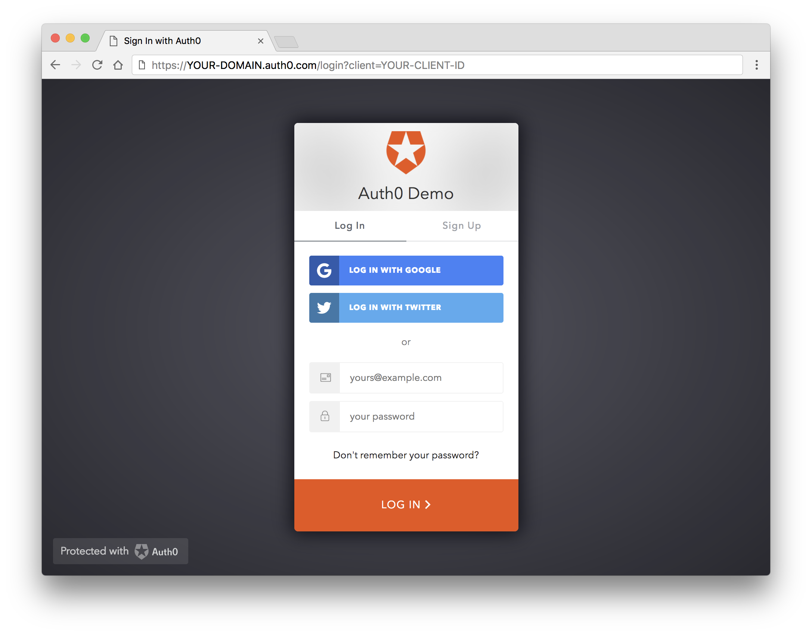

**This post is original content developed by me for the [Auth0's blog](https://auth0.com/blog) and has been re-posted here as part of an online portfolio with permission. Relevant attribution and canonical links exist. [Click here to see the original](https://auth0.com/blog/common-threats-in-web-app-security/).**

**TL;DR:** In this article we'll attempt to cover a comprehensive security strategy for web applications to protect against common threats in web application security and mitigate their impact.

---

## Introduction

Whether you manage your own infrastructure or not, having robust infrastructure security is great. But it becomes a bit redundant if your client's data is just as exposed through your web applications. Having infrastructure security is important, but there are considerations for front and backend developers that _must be considered_.

In this era of modern web technology, security should not be a band-aid or an after-thought. It should be at the very foundation of planning, managing and building your web applications. 

**But it doesn't stop there.**

Web application security is an ongoing and ever-changing climate you **do not** want to be caught short.

You must continuously monitor, and work, to ensure that your company doesn't become [another statistic in the world of security breaches](http://breachlevelindex.com/top-data-breaches). Regardless of programming language or framework, there are plenty of generic security practices you could follow from the very start of any project.

In this article I'll introduce you to my biggest tips for top to bottom (Front end to Back end) security for your web applications.

## HTTP Strict Transport Security (HSTS) header

HSTS is a header you can provide the browser that enforces HTTPS across your entire web application. 

There is no excuse these days to land on a website that isn't encrypting the communication between your web browser and their servers. While SSL certificates used to be a marketing tool for corporations to prove how safe they were, these days SSL certificates are both **free** and **easy to get**. Certificate authorities like [Let's Encrypt](https://letsencrypt.org) have the backing of [some of the world's best known companies](https://letsencrypt.org/sponsors/), because **a secure internet is better for everyone!**

Simply owning an SSL certificate will not make your web application secure. You need to tell your application how to force traffic through it. Some websites do this with a HTTP redirect, but providing as HSTS header is just as effective, without that overhead.

Here are some examples of a HSTS header.

```
Strict-Transport-Security: max-age=630720; includeSubDomains; preload
```

*To see if it's set on a site with a CURL request:*

```bash
curl -s -D- https://paypal.com | grep Strict-Transport-Security
```

*And to set it in Node.js response:*

```js
function requestHandler(req, res) {
  res.setHeader('Strict-Transport-Security', 'max-age=630720; includeSubDomains; preload');
}
```

> "If a website accepts a connection through HTTP and redirects to HTTPS, visitors may initially communicate with the non-encrypted version of the site before being redirected, if, for example, the visitor types [http://www.foo.com/](http://www.foo.com/) or even just [foo.com](http://foo.com/). This creates an opportunity for a man-in-the-middle attack. The redirect could be exploited to direct visitors to a malicious site instead of the secure version of the original site." – [developer.mozilla.org](https://developer.mozilla.org/en-US/docs/Web/HTTP/Headers/Strict-Transport-Security)


In this example of a HSTS header, we have three *directives*.  `max-age`, `includeSubDomains` and `preload`.

- `max-age=<expire-time>`

  The time, in seconds, that the browser should remember that a site is only to be accessed using HTTPS. This means that the browser will automatically use HTTPS to access the site for as long as `max-age` has not expired.

- `includeSubDomains` _Optional_

  If this optional parameter is specified, this rule applies to all of the site's subdomains as well.

- `preload` _Optional_

  Google maintains [a HSTS preload service](https://hstspreload.appspot.com/). Most modern browsers support (or intend to support) this service and if your site is registered, it will never contact the service through insecure HTTP requests. It will assume the site uses HTTPS before it ever connects.

> **Note:** If you start to use HSTS and your site has not been setup with HTTPS certificates then your site would become unreachable.


## X-XSS-Protection header

XSS (Cross Site Scripting) is the most common of all web application attacks.

XSS occurs when malicious scripts are injected into otherwise trusted web applications. Most modern browsers come prepared to protect against XSS. We can ensure this is enabled by sending the `X-XSS-Protection` header.

> **Note:** `X-XSS-Protection` header is not available in Firefox and has been rendered entirely redundant by the Content Security Policy header, which we detail below.

Here are some examples of an `X-XSS-Protection` header.

```
X-XSS-Protection: 1; mode=block
```

*And to set it in Node.js response:*

```js
function requestHandler(req, res) {
  res.setHeader('X-XSS-Protection', '1; mode=block');
}
```

In this example of a XSS header, we have three *directives*.  `1` and `mode`. Also one missing one,`report`.

- `1`

  This is basically a boolean value that determines whether XSS filtering is enabled. Change it to `0` to disable it. Without the optional `mode` or `report` directives, the browser will just sanitize the page, even removing the affected parts.
  
- `mode=block` _Optional_

  Enables XSS filtering. Rather than sanitizing the page, the browser will prevent rendering of the page if an attack is detected.
  
- `report=<report url>`

  Enables XSS filtering. If a cross-site scripting attack is detected, the browser will sanitize the page and report the violation.
  


## X-Frame-Options header

Clickjacking occurs when an attacker injects transparent or opaque objects into your web application. These might be an invisible layer over other functionality or designed to look like part of your application. Similar methods can be used for hijacking text boxes, to make you think you're putting your personal details or payment info (or both) into the application you're using!

One of the most famous examples of Clickjacking was against [the Adobe Flash plugin settings page](http://www.macromedia.com/support/documentation/en/flashplayer/help/settings_manager06.html). The infected application was loaded into an invisible window and tricked the user into relaxing their security settings, like allowing the web application to use your camera or microphone!

To prevent click jacking, there is another header! 

Servers offer Browsers a Header Protocol named `X-Frame-Options`. This protocol allows us to specify domains to accept iFrames from. It also allows us to state which sites our web application can be embedded on. 

Here are some examples of an `X-Frame-Options` header.

```
X-Frame-Options: SAMEORIGIN
```

*And to set it in Node.js response:*

```js
function requestHandler(req, res) {
  res.setHeader('X-Frame-Options', 'SAMEORIGIN');
}
```

With this header, we get three possible *directives*.  `DENY`, `ALLOW-FROM`, and `SAMEORIGIN`.

- `DENY`

  This blocks all framing.
  
- `ALLOW-FROM`

  This allows you to provide a list of domains to allow framing within.
  
- `SAMEORIGIN`

  This means framing is only allowed within the current domain.
  


## Content Security Policy (CSP) header

CSP is a more modern layer of security that helps detect and mitigate more than one kind of attack, including XSS and data injection attacks.

Designed to be fully backwards compatible, browsers that don't support it will still work with servers using it, by ignoring it and defaulting to the standard same-origin policy for web content.

It works by telling the browser exactly which URLs content on your site should be loaded from.

To include a CSP header that allows only internal and *Google Analytics*, in an Express.js server, you could do the following:

```js
const express = require('express');
const app = express();

app.use(function(req, res, next) {
    res.setHeader("Content-Security-Policy", "script-src 'self' https://analytics.google.com");
    return next();
});

app.use(express.static(__dirname + '/'));

app.listen(process.env.PORT || 3000);
```

However, if we do not wish to allow *any* external sites to execute scripts on our web application, we could simply include the following:

```js
function requestHandler(req, res) {
	res.setHeader( 'Content-Security-Policy', "script-src 'self'" );
}
```

Note the `script-src` directive here, that we have set to `self`, therefore only allowing scripts from within our own domain. Content Security Policies are both excellent and very powerful, but must be used cautiously. Just as with HSTS, incorrect configuration could cause unforeseen issues or missing content. This will also disable inline JavaScript unless it's provided `unsafe-inline` keyword, a hash like ('sha256-OsJINy4ZgkXN5pDjr32TfT/PBETcXuD9koo2t1mYDzg='), or a nonce ('nonce-...'), which is great for security!
  


## Cross Site Request Forgery (CSRF)

Cross Site Request Forgery is an attack where by the attacker impersonates an authorized user and makes requests on their behalf, like resetting a password, or updating an email address.

We've been mitigating CSRF requests for years by checking HTTP headers such as the `Origin` and `Referer`. Whilst these do work, we have a new defence against CSRF. The `SameSite` cookie directive. `SameSite` is relatively new and has only been around for a year or so. But it's still widely unknown. Once applied, prevents the browser from sending this cookie along with cross-site requests

An example of the SameSite `directive`:

```
Set-Cookie: sess=sessionid123; path=/; SameSite
```


## Cookies

Cookies are an important feature of web applications, usually carrying our users session identification, so the server knows you're you on each request. The `SameSite` directive might be a good way to protect your session information, but **Cookie Prefixing** is a new and under utilized method to ensure a cookie is absolutely secure.

Some user agent implementations support the following cookie prefixes:

- `__Secure` - Tells the browser that it should only include the cookie in requests that are sent over secure channel.
- `__Host` - Tells the browser not only that it should only include the cookie in requests that are sent over secure channel, this will also tell the browser to only use the cookie from a secure origin and the scope is limited to a path attribute passed down by the server. If the server omits the path attribute the "directory" of the request URI is used. It also signals that the domain attribute must not be present, which prevents the cookie from being sent to other domains.

Effectively a `__Host` cookie is very specific to where it was intended to be used and therefore should be considered the most secure way to define one.


## Conclusion

The most effective method for maintaining the security of your web applications is keeping up-to-date with vulnerabilities. They're a dynamic topic in a dynamic environment and the attacker is always one step ahead.

Complacency is the enemy. The moment you relax and think you're safe, you're going to miss an opportunity to improve security on your web application.

By following the advice in this article, staying up-to-date with announcements, and having an in-depth knowledge of your systems, you can rest assured that you're doing what you can to mitigate attacks.

Many developers and organizations ignore security altogether. It does not take an entire development team to implement the changes in this article, but it does take a certain investment in time and culture to know you're working towards protecting your data.

So, from enforcing HTTPS with Strict Transport Security, to securing our web application with a Content Security Policy header, we're well on our way to ensuring the security of our web applications.

## Aside: Auth0 Authentication with JavaScript

At [Auth0](https://auth0.com/), we make heavy use of full-stack JavaScript to help our customers to [manage user identities including password resets, creating and provisioning, blocking and deleting users](https://auth0.com/user-management). We also created a serverless platform, called [Auth0 Extend](https://auth0.com/extend/), that enables customers to run arbitrary JavaScript functions securely. Therefore, it must come as no surprise that using our identity management platform on JavaScript web apps is a piece of cake.

[Auth0 offers a **free tier**](https://auth0.com/pricing) to get started with modern authentication. Check it out, or <a href="https://auth0.com/signup" data-amp-replace="CLIENT_ID" data-amp-addparams="anonId=CLIENT_ID(cid-scope-cookie-fallback-name)">sign up for a free Auth0 account here</a>!



It's as easy as installing the [`auth0-js`](https://github.com/auth0/auth0.js) and [`jwt-decode`](https://github.com/auth0/jwt-decode) node modules like so:

```bash
npm install jwt-decode auth0-js --save
```

Then implement the following in your JS app:

```js
const auth0 = new auth0.WebAuth({
  clientID: "YOUR-AUTH0-CLIENT-ID", // E.g., you.auth0.com
  domain: "YOUR-AUTH0-DOMAIN",
  scope: "openid email profile YOUR-ADDITIONAL-SCOPES",
  audience: "YOUR-API-AUDIENCES", // See https://auth0.com/docs/api-auth
  responseType: "token id_token",
  redirectUri: "http://localhost:9000" //YOUR-REDIRECT-URL
});

function logout() {
  localStorage.removeItem('id_token');
  localStorage.removeItem('access_token');
  window.location.href = "/";
}

function showProfileInfo(profile) {
  var btnLogin = document.getElementById('btn-login');
  var btnLogout = document.getElementById('btn-logout');
  var avatar = document.getElementById('avatar');
  document.getElementById('nickname').textContent = profile.nickname;
  btnLogin.style.display = "none";
  avatar.src = profile.picture;
  avatar.style.display = "block";
  btnLogout.style.display = "block";
}

function retrieveProfile() {
  var idToken = localStorage.getItem('id_token');
  if (idToken) {
    try {
      const profile = jwt_decode(idToken);
      showProfileInfo(profile);
    } catch (err) {
      alert('There was an error getting the profile: ' + err.message);
    }
  }
}

auth0.parseHash(window.location.hash, (err, result) => {
  if (err || !result) {
     // Handle error
    return;
  }

  // You can use the ID token to get user information in the frontend.
  localStorage.setItem('id_token', result.idToken);
  // You can use this token to interact with server-side APIs.
  localStorage.setItem('access_token', result.accessToken);
  retrieveProfile();
});

function afterLoad() {
  // buttons
  var btnLogin = document.getElementById('btn-login');
  var btnLogout = document.getElementById('btn-logout');

  btnLogin.addEventListener('click', function() {
    auth0.authorize();
  });

  btnLogout.addEventListener('click', function() {
    logout();
  });

  retrieveProfile();
}

window.addEventListener('load', afterLoad);
```

Get [the full example using this code](https://github.com/auth0-blog/es2015-rundown-example).

Go ahead and check out our [Quick Start tutorials](https://auth0.com/docs/quickstarts) to learn how to implement authentication using different languages and frameworks in your apps.
