**This post is original content developed by me for the [Auth0's blog](https://auth0.com/blog) and has been re-posted here as part of an online portfolio with permission. Relevant attribution and canonical links exist. [Click here to see the original](https://auth0.com/blog/helloworld-with-auth0/).**

**TL;DR:** In this guide, you'll finish adding authentication to our simple [single page application](https://auth0.com/docs/sso/current/single-page-apps), customize Auth0 [Lock](https://auth0.com/docs/libraries/lock/v11), enable [social login](https://auth0.com/blog/social-login-on-the-rise/) with Facebook, and set up [multi-factor authentication](https://auth0.com/docs/multifactor-authentication). If none of this makes any sense, don't worry. We're going to explain that as well.

> ***Note:*** This guide assumes you're on a Mac. Drop us a comment below and we can provide updated instructions for a Windows machine or Ubuntu machine.

Before you get started, you're going to need **NodeJS** installed on your computer. This bit of software allows you to run stuff locally, like web servers and code.

> ***Note:*** This guide has been developed with a target audience that may have no exposure to development. If you're a developer, you might want to try out [one of our many other blog articles](https://www.auth0.com/blog), on a language you might be familiar with.

## Pre-requisites

You're going to need some bits before we get started.

> ***Tip:*** With no exposure to development or editing code, you might find yourself scratching your head. Use the comments section at the bottom of this guide to get help from an Auth0 engineer – you might also find some helpful info.

### NodeJS

If you do not have **NodeJS** installed on your computer, install that now. If you don't know whether or not you have it, it shouldn't hurt to install it anyway.

Go to [nodejs.org](https://nodejs.org/en/) where you're looking to download a version labelled **LTS**, or *long-term support*. 

> ***Note:*** **LTS** is the version most likely to be supported for the next few months. *Long-term support* versions usually are the most robust, tested and adopted versions which are only subject to smaller updates that try not to introduce changes that could break your software.

Double-click on your downloaded **NodeJS** package and install it.

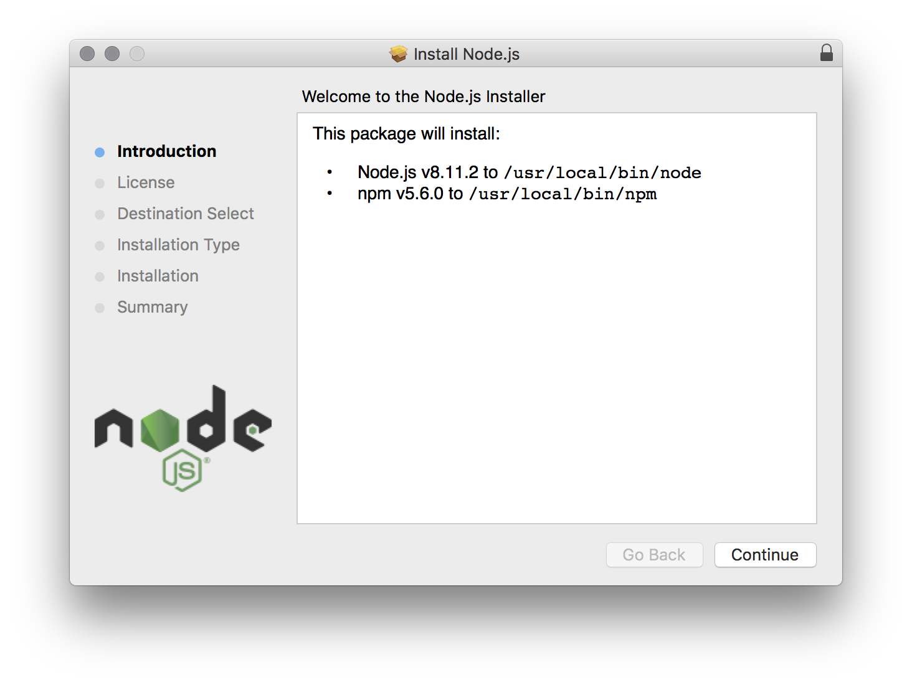

### What is Terminal?

Nothing to install this time. But, take a look at what Terminal looks like.

Press **Command+Space** together. This opens *Spotlight Search*, where you can type ***Terminal*** and press enter. This opens up ***Terminal*** for you.


Being in ***Terminal*** is like being in a folder that you can tell what to do, without using your mouse.

You should be able to issue a command like this, to change to your ***Downloads*** directory.

```bash
cd ~/Downloads/
```

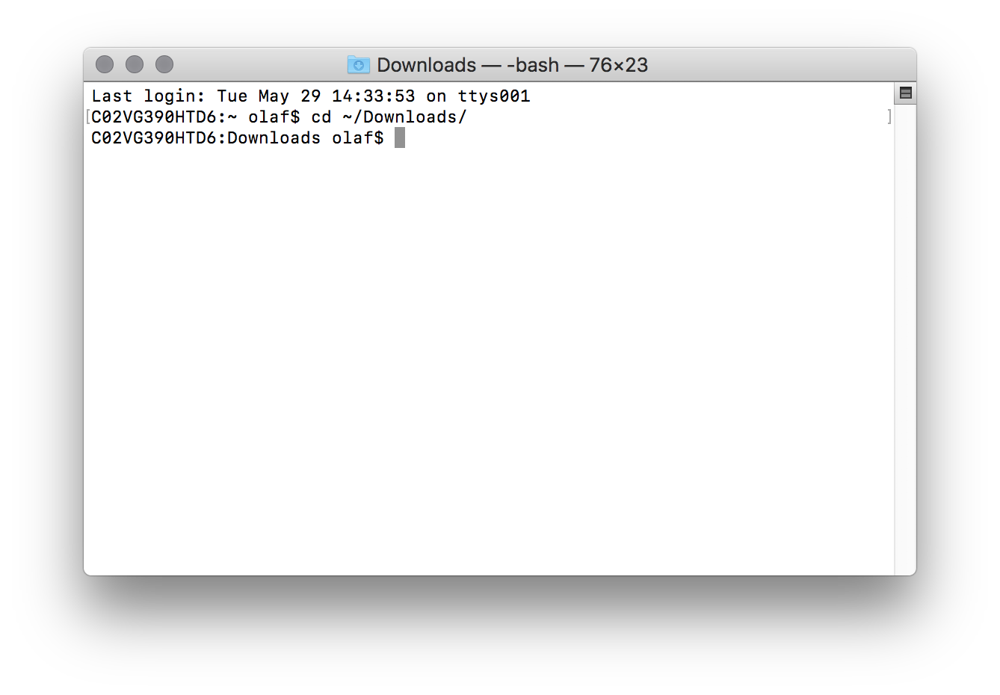

Remember what you did here, because you'll need to get to use ***Terminal*** to access a directory in this guide.

## Lab 1 - Sign up for Auth0

<a href="https://auth0.com/signup" data-amp-replace="CLIENT_ID" data-amp-addparams="anonId=CLIENT_ID(cid-scope-cookie-fallback-name)">Sign up for an Auth0 account</a>.

You can use an existing account, or an existing tenant, but I would recommend a nice clean place to start by signing up a fresh and creating a new tenant from there.

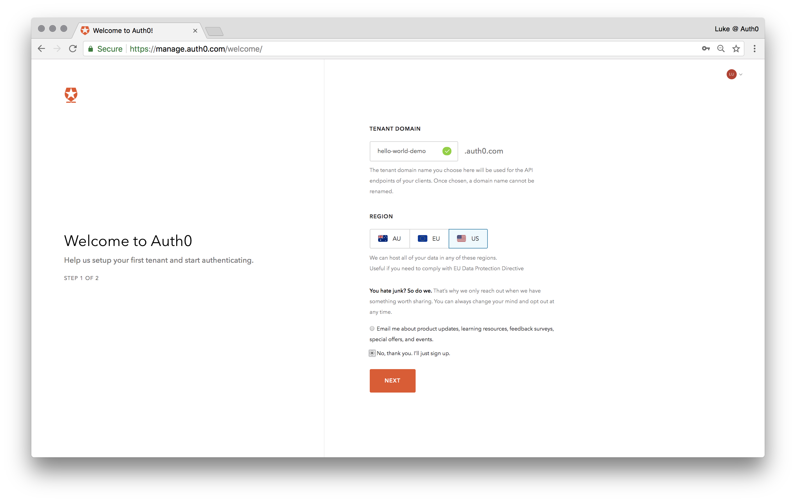


## Lab 2 - Create and run an application

1. Go to your [**Auth0 Dashboard**](https://manage.auth0.com/#/) and click the "[create a new application](https://manage.auth0.com/#/applications/create)" button.

2. Name your new application and give it the type "Single Page Web Applications", and click the "Create" button.

   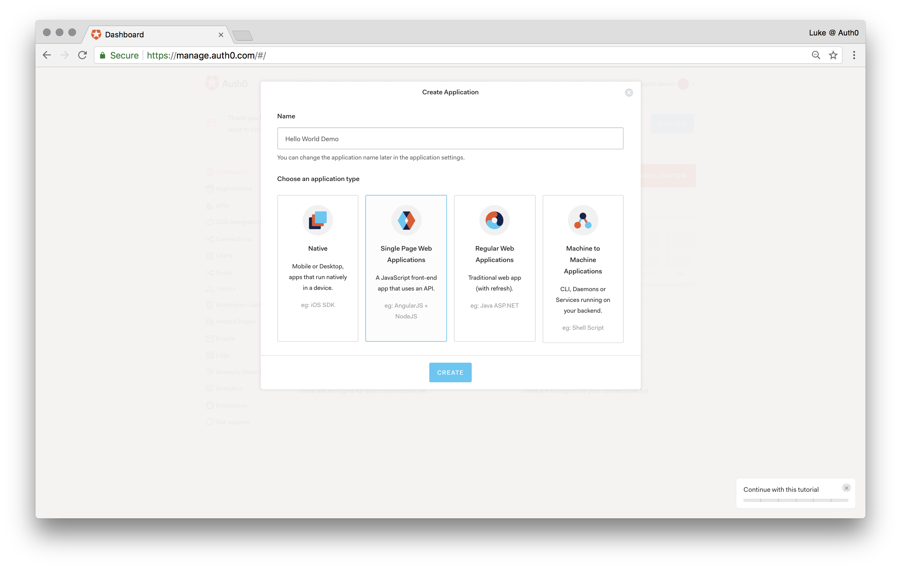

3. As your technology, select JavaScript (JS). You can also search for it in the search box.

   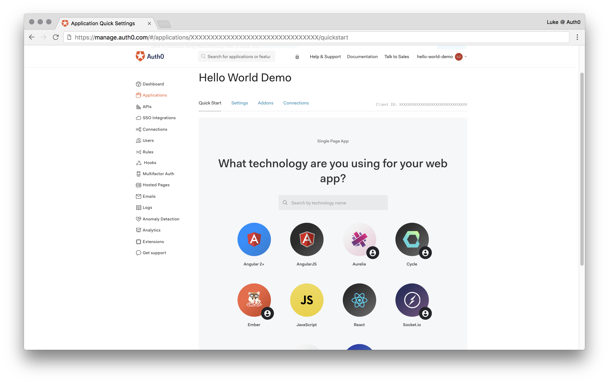

4. Download the **sample project** by clicking ***DOWNLOAD***, it will be named ***01-login.zip***.

   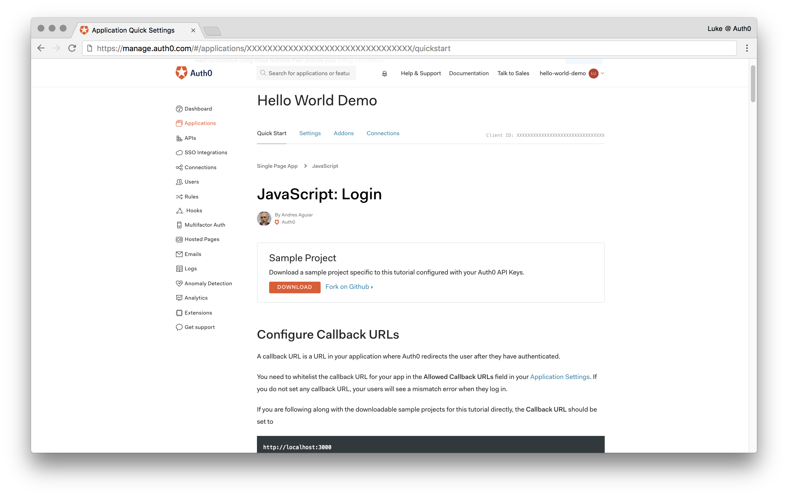

5. Using **Finder** (Mac's standard file browser), find the **sample project** zip file ***01-login.zip*** in your ***Downloads*** directory, and double click it to extract it.

   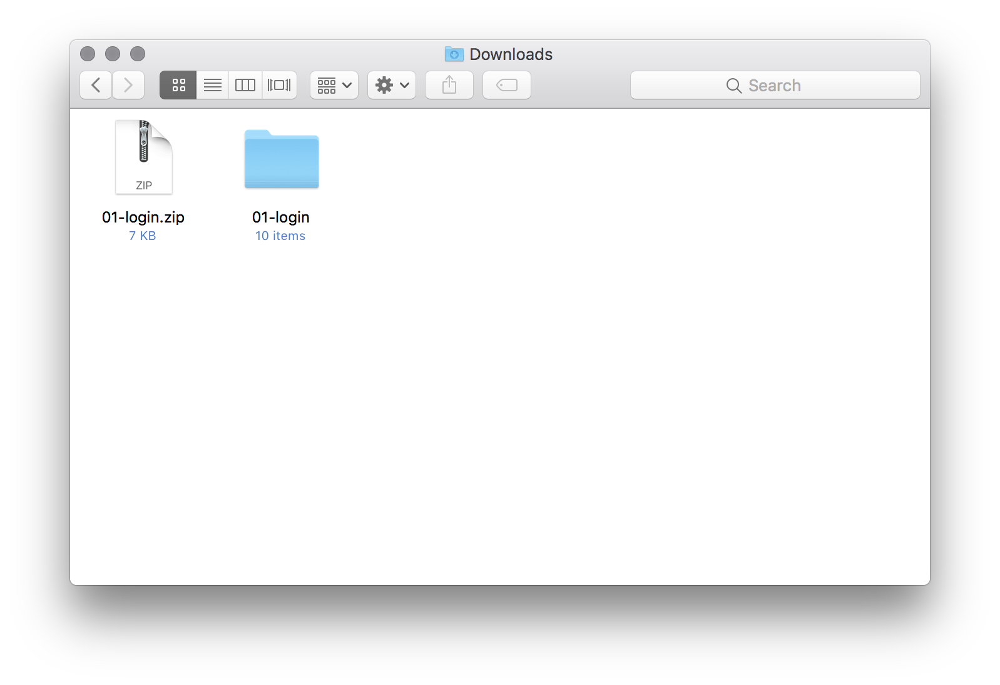

> ***Tip:*** If you see text `styled like this` in the guide, it may valuable to know you can copy and paste it to make life easier. Copy and paste is a developers best friend, as it reduces the time of repetitive entry, and it reduces the regularity of typos in what you might be copying (unless you copy a typo!!)

6. Open ***Terminal*** and change to the **sample project** directory by typing `cd ~/Downloads/01-login` into terminal and pressing enter.

   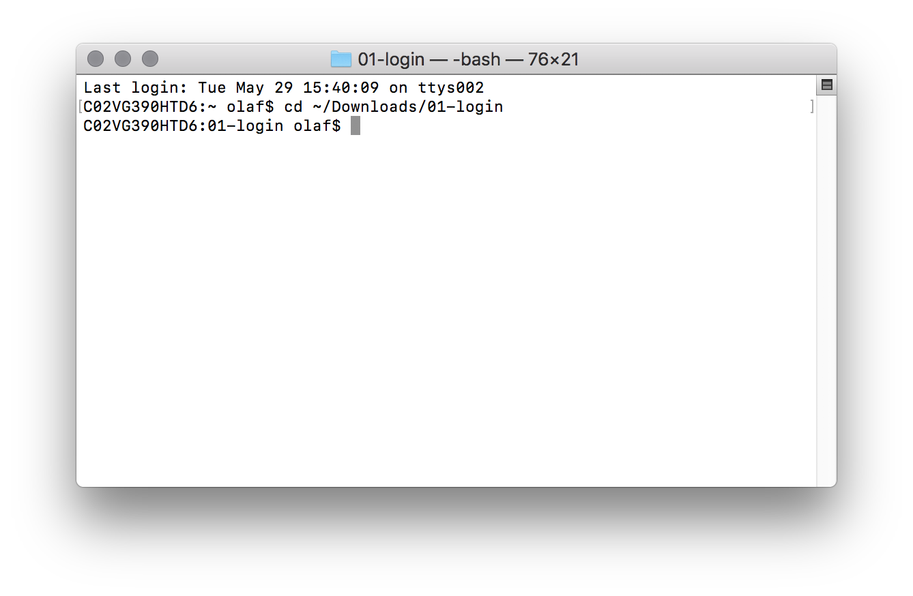

7. Run these two commands in your ***Terminal*** window.

   - Type `npm install` and press enter. It will install some stuff, be patient!
   - Type `npm start` and press enter. This will now "run" our **sample project**.

   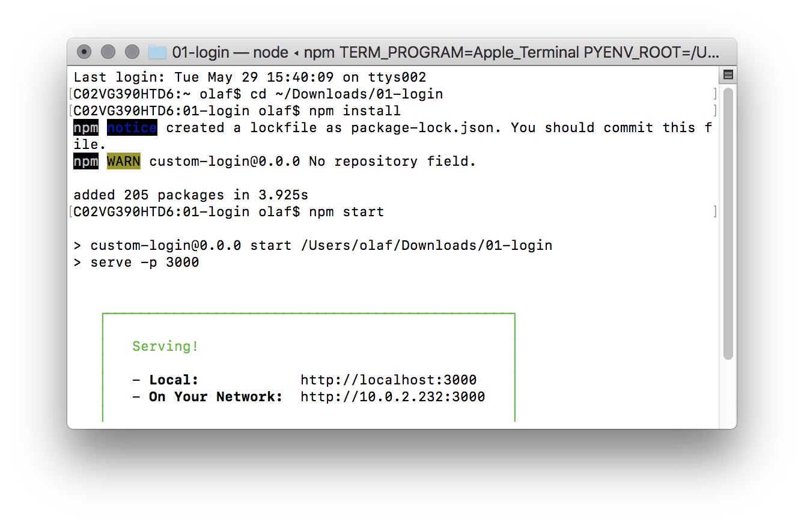
   
8. Run the **sample project** in your favourite web browser by going to this url: `http://localhost:3000`

   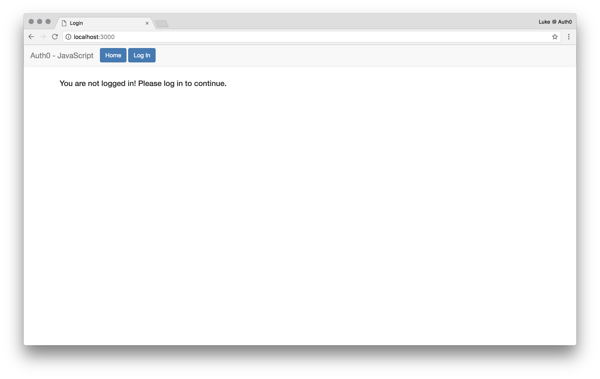
   
> ***Note:*** If you try and log in on the **sample project**, you'll get an error.

## Lab 2 - Test

The Log In button is broken you need to fix it.

> ***Note:*** The **sample project**'s source code is pre-configured with your application settings from the forms you filled out. So what you're looking for is in your Auth0 application config.

## Lab 3 - Customize Lock's look and feel

1. Go to your [**Auth0 Dashboard**](https://manage.auth0.com/#/) and open up **Hosted Pages** from the main menu.

   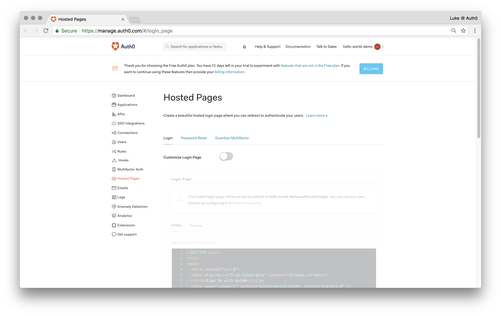

2. Enable ***Custom Login Page***.

> ***Tip:*** You can search for text on a web page using **Command+F** and typing (or pasting) the text you're looking for. Try text that is more likely to be unique!

## Lab 3 - Test

Once you've enabled ***Custom Login Page***, you'll see the code editor become available below. Don't be afraid! In this section, you'll find some code that can be ***uncommented*** out. 

> ***Tip:*** Commented out code is ignored when the code is run on the server. It begins with `//` and it will be grey in appearance compared to the colourful highlighting of the rest of the code.

You need to find, uncomment (enable) and edit the `theme`'s `logo` and `primaryColor`.

Please update the following:
- The `logo`'s value to `https://cdn.auth0.com/website/oof/oof.png`
- The `primaryColor`'s value to `black`

Click save once you've made your changes.

Test your **sample project**'s login. It should look something like this.

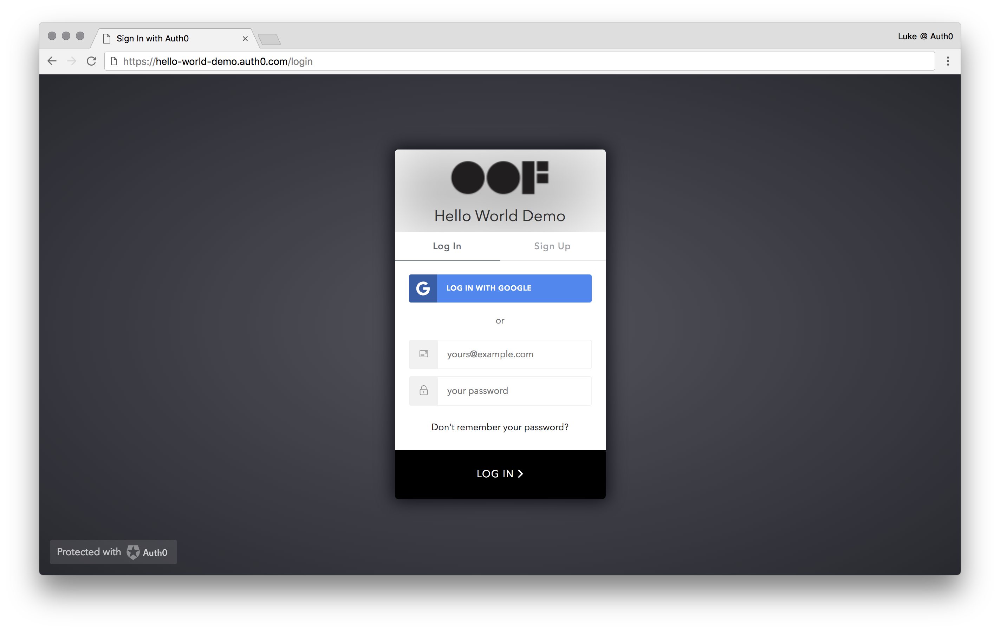

## Lab 4 - Enable Facebook login

1. Go to your [**Auth0 Dashboard**](https://manage.auth0.com/#/) and open up **Connections** -> **Social** from the main menu.

## Lab 4 - Test

Now enable **Facebook** login.

Test your **sample project**'s login. It should look something like this.

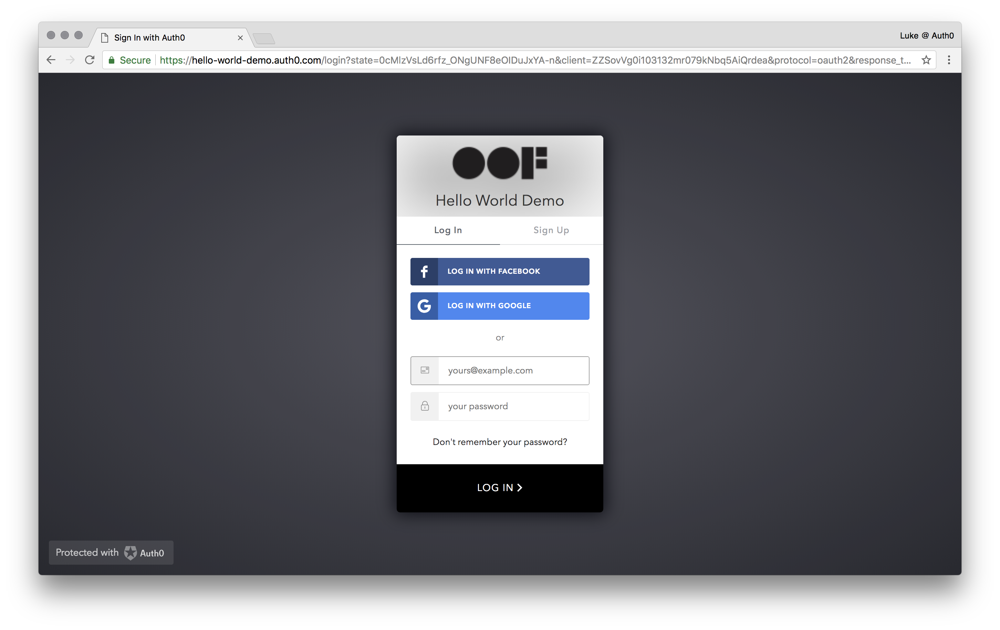

## Lab 5 - Enable Multifactor Auth with Guardian

1. Go to your [**Auth0 Dashboard**](https://manage.auth0.com/#/) and open up **Multifactor Auth** from the main menu.

2. Enable **Push** and **SMS** multifactor authentication.

## Lab 5 - Test

Instead of just logging in, sign up using a username and password on your **sample project**. You should spot multifactor is working when you come across this.

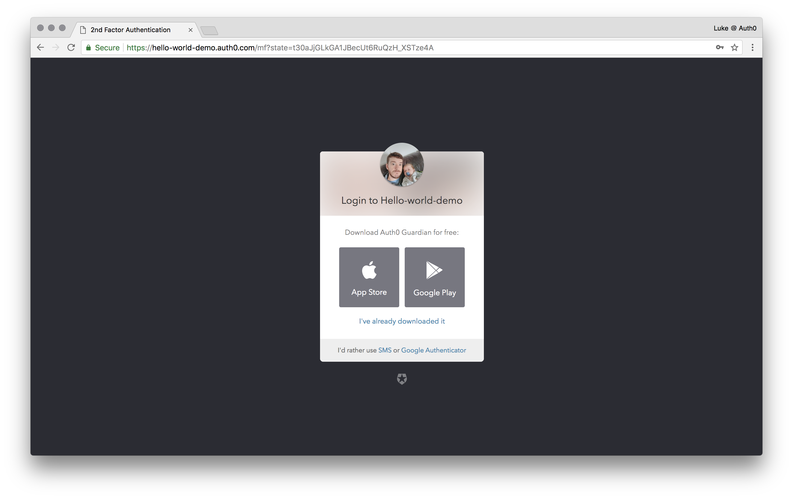

## Lab 6 - Restrict sign up to your domain

1. Go to your [**Auth0 Dashboard**](https://manage.auth0.com/#/) and open up **Rules** from the main menu.

2. Click on **CREATE RULE**.

3. Find the template rule `Email domain whitelist` under the access control section and select it.

4. Edit the `whitelist` to only accept your email domain. e.g. **@gmail.com** or **@auth0.com**.

## Lab 6 - Test

Try and sign up with an email address not inside the domain you just limited it to. You should get a nice error!

## Conclusion

By now you should be a pro! Right?

If you've got this far and you've skipped some labs, or struggled to even get started; don't be disheartened or dismayed. This is a programming guide for people who are not programmers. Use our comments section below to get in touch with any questions you might have.

The Auth0 features and products we've covered are:

### Auth0's Universal Login

Using [Auth0's Auth0.js SDK](https://auth0.com/docs/libraries/auth0js) in your **sample project** you've quickly got a web page that you can login to using [Auth0's Universal Login](https://auth0.com/docs/hosted-pages/login).

Auth0's Universal Login is the most secure way to easily authenticate users for your applications. The login page appearance and behavior is easily customizable right from the [Auth0 Dashboard](https://manage.auth0.com/). By default, the login page uses [Auth0's Lock Widget](https://auth0.com/docs/libraries/lock) to authenticate your users, but the code of the login page can be customized to replace Lock with the [Lock Passwordless widget](https://auth0.com/docs/connections/passwordless), or an entirely custom UI can be built in its place, using [Auth0's Auth0.js SDK](https://auth0.com/docs/libraries/auth0js/v9) for authentication.

### Auth0's Customizable Hosted Pages

We used [Auth0's Customizable Hosted Pages](https://auth0.com/docs/hosted-pages#customize-your-hosted-page) to brand our login and sign up form.

Auth0 offers you the ability to display customized pages containing Auth0-related functionality and to which Auth0 redirects your users during the authorization process.

### Identity Providers

Using [Auth0's support for Identity Providers](https://auth0.com/docs/identityproviders), we setup Facebook as a **Social Provider** to authenticate users.

An Identity Provider is a service that can provide identity information for you. For example, Google is an Identity Provider. If you log in to a site using your Google account, then a Google server will send your identity information to that site.

Auth0 sits between your app and the Identity Provider that authenticates your users as an **identity hub**. This adds a level of abstraction so your app and your data can be isolated from any changes to and idiosyncrasies of each provider.

### Multifactor Authentication (MFA) with Auth0's Guardian

We setup [MFA with Auth0's Guardian solution](https://auth0.com/docs/multifactor-authentication/guardian) to provide a simple and secure way to implement MFA.

When using Guardian with Auth0, users will be prompted for additional authentication from the Guardian mobile application, helping to provide a more secure login.

MFA is a method of verifying a user's identity by requiring them to present more than one piece of identifying information. This method provides an additional layer of security, decreasing the likelihood of unauthorized access.

### Auth0 Rules

We've used an [Auth0 Rule](https://auth0.com/docs/rules/current) to restrict sign up to users only from the same domain as you.

Rules are functions written in JavaScript that are executed when a user authenticates to your application. They run once the authentication process is complete and you can use them to customize and extend Auth0's capabilities. They can be chained together for modular coding and can be turned on and off individually.

## About Auth0

Auth0, a global leader in Identity-as-a-Service (IDaaS), provides thousands of enterprise customers with a Universal Identity Platform for their web, mobile, IoT, and internal applications. Its extensible platform seamlessly authenticates and secures more than 1.5B logins per month, making it loved by developers and trusted by global enterprises. The company's U.S. headquarters in Bellevue, WA, and additional offices in Buenos Aires, London, Tokyo, and Sydney, support its customers that are located in 70+ countries.

For more information, visit [https://auth0.com](https://auth0.com/) or follow [@auth0 on Twitter](https://twitter.com/auth0).

<div style="margin: 1000px 0; display: block; text-transform: uppercase; text-align: center;">~ Keep scrolling for answers ~</div>

## Lab Answers

### Lab 2

The callback url is missing from your application config. Head to the settings tab of the `Hello World Demo` application we created on the Auth0 dashboard. Look for somewhere to set a callback URL to `http://localhost:3000` and click save when you're done.

> ***Note:*** A callback URL is a URL in your application where Auth0 redirects the user after they have authenticated. The callback page is usually prepared to read and validate your authentication on your return.

### Lab 3

Search the ***Custom Login Page*** code for this code:

```js
      theme: {
        //logo:            'YOUR LOGO HERE',
        //primaryColor:    'green'
      },
```

Replace it with this code:

```js
      theme: {
        logo:            'https://cdn.auth0.com/website/oof/oof.png',
        primaryColor:    'black'
      },
```

### Lab 4

You need to find the Facebook login switch and turn it on. At this stage you don't need to provide any further information or configuration, just save the default settings and ensure the switch is enabled.

> ***Note:*** This isn't advisable for production environments, that would need to configure their Facebook login with their own development keys and configuration.

### Lab 5

You need to use a username and password for signup. Multifactor authentication won't work if you try and sign up with a social login (Facebook or Google are probably enabled by now).

Make sure you're signing up on your **sample project** as well, not just logging in.

Head to `http://localhost:3000/` in your favourite browser and click on our ***Log In*** button. When you're at the Auth0 login page, select the **Sign Up** tab instead.

### Lab 6

Search the **Edit Rule** page after you've clicked on `Email domain whitelist` for this code:

```js
    var whitelist = ['example.com', 'example.org']; //authorized domains
```

Replace it with this code:

> ***Tip:*** Make sure to change `gmail.com` to the domain of your email address. e.g. if your email is **joe.bloggs@gmail.com** your domain is **gmail.com**, but if your email is **luke.oliff@auth0.com** your domain is **auth0.com**.

```js
    var whitelist = ['gmail.com']; //authorized domains
```

<div style="margin: 20px 0; display: block; text-transform: uppercase; text-align: center;">~ EOF ~</div>
